# VULCA

[](https://pypi.org/project/vulca/)
[](https://pypi.org/project/vulca/)
[](https://github.com/vulca-org/vulca/blob/main/LICENSE)
[]()
[]()

**AI-native cultural art creation organism.** Create, evaluate, and evolve artwork across 13 cultural traditions — L1-L5 scoring, self-evolving weights, full layer editing, and 5 algorithmic analysis tools. 21 MCP tools, all from one `pip install`.

<p align="center">
  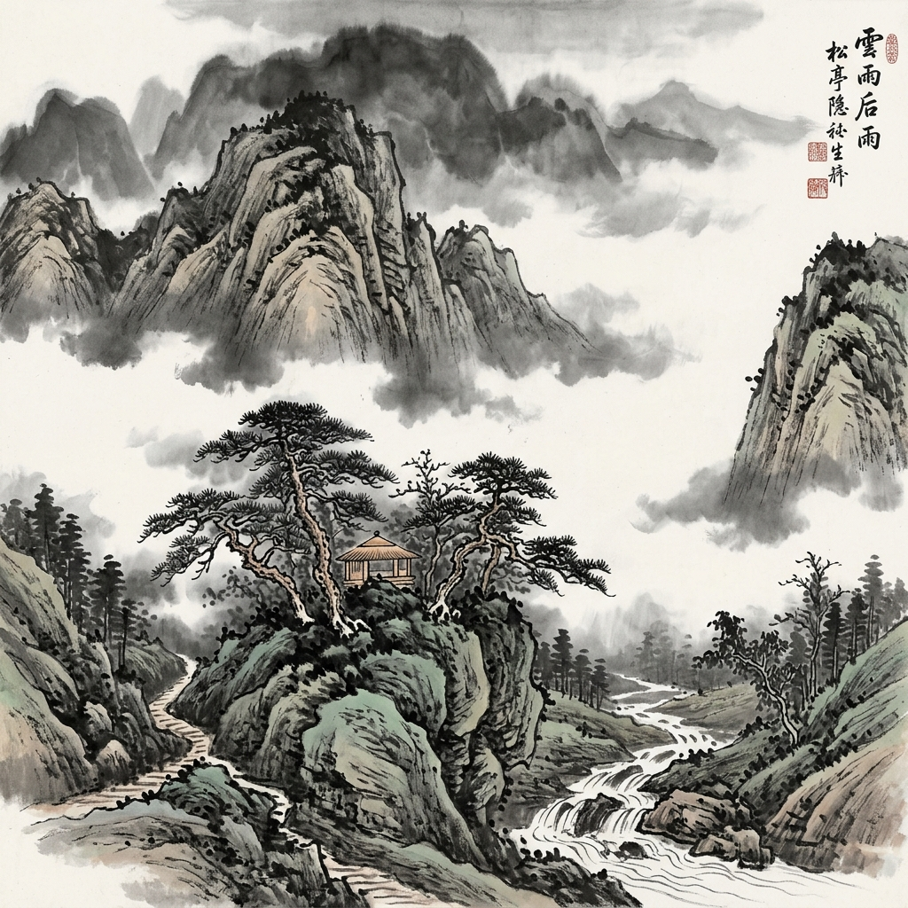
  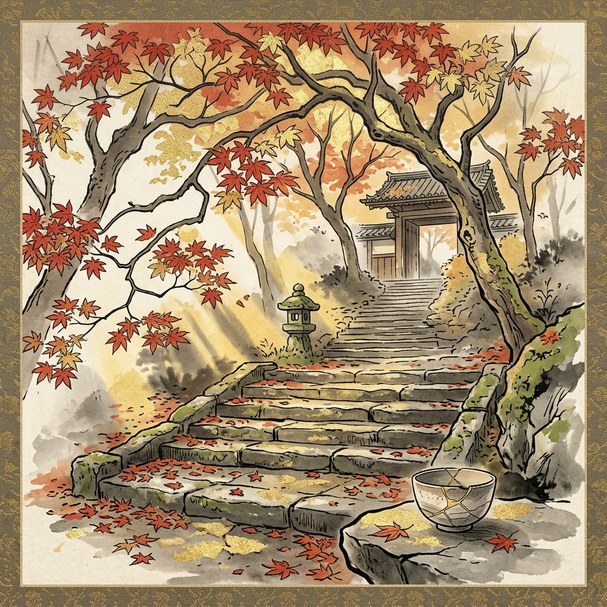
  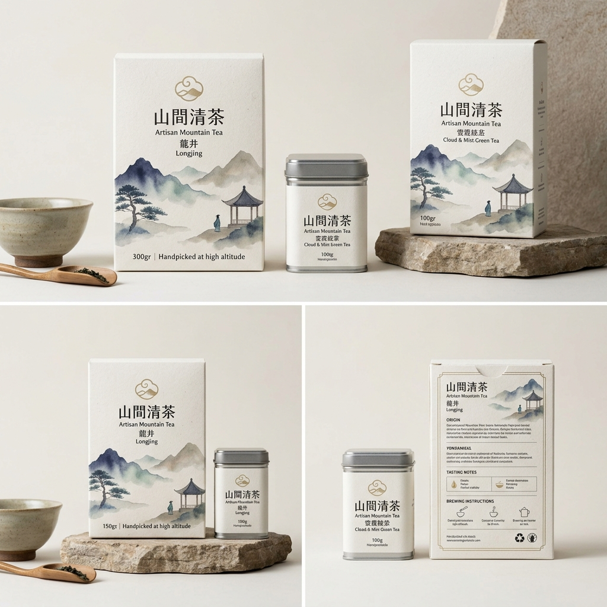
</p>

```bash
pip install vulca
export GOOGLE_API_KEY=your-key
vulca create "Misty mountains after rain, pine pavilion in clouds" -t chinese_xieyi -o artwork.png
# → Score: 0.915 | Tradition: chinese_xieyi | 1 round | 43s
# → Image: artwork.png
```

<details>
<summary><strong>See it in action</strong> (GIF)</summary>
<p align="center">
  
</p>
</details>

> Based on peer-reviewed research: [VULCA Framework](https://aclanthology.org/2025.findings-emnlp/) (EMNLP 2025 Findings) and [VULCA-Bench](https://arxiv.org/abs/2601.07986) (7,410 samples, 9 traditions).

---

## Architecture

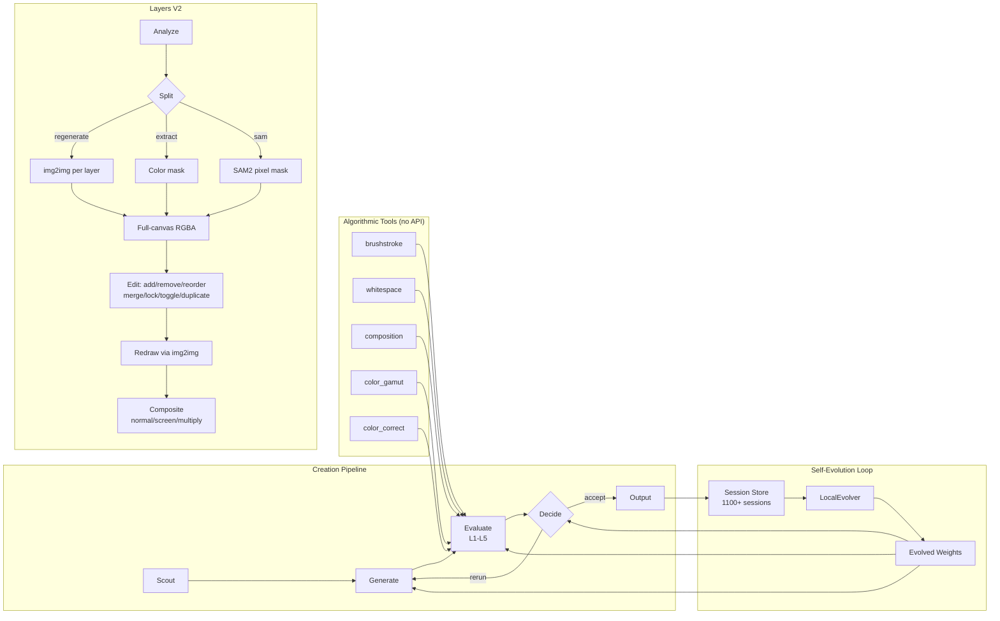
```mermaid
graph LR
    subgraph Pipeline["Creation Pipeline"]
        S[Scout] --> G[Generate]
        G --> E[Evaluate<br/>L1-L5]
        E --> D{Decide}
        D -->|rerun| G
        D -->|accept| OUT[Output]
    end

    subgraph Evolution["Self-Evolution Loop"]
        OUT --> SE[Session Store<br/>1100+ sessions]
        SE --> LE[LocalEvolver]
        LE --> EW[Evolved Weights]
        EW --> G
        EW --> E
        EW --> D
    end

    subgraph Tools["Algorithmic Tools (no API)"]
        T1[brushstroke] --> E
        T2[whitespace] --> E
        T3[composition] --> E
        T4[color_gamut] --> E
        T5[color_correct] --> E
    end

    subgraph LayersV2["Layers V2"]
        AN[Analyze] --> SP{Split}
        SP -->|regenerate| IG[img2img per layer]
        SP -->|extract| CM[Color mask]
        SP -->|sam| SAM[SAM2 pixel mask]
        IG --> FC[Full-canvas RGBA]
        CM --> FC
        SAM --> FC
        FC --> ED[Edit: add/remove/reorder<br/>merge/lock/toggle/duplicate]
        ED --> RD[Redraw via img2img]
        RD --> CO[Composite<br/>normal/screen/multiply]
    end
```

**4 entry points, 1 engine**: CLI, Python SDK, MCP (21 tools), ComfyUI (11 nodes) — all share `vulca.pipeline.execute()`.

---

## Create — One Command, Multiple Styles

<details>
<summary>See create workflow (GIF)</summary>
<p align="center">
  
</p>
</details>

```bash
vulca create "Misty mountains after rain" -t chinese_xieyi -o landscape.png
vulca create "Tea packaging, Eastern aesthetics" -t brand_design --colors "#C87F4A,#5F8A50"
vulca create "Zen garden" --reference shanshui.png --ref-type style -t japanese_traditional
```

**Style Transfer** — use any image as reference:

<p align="center">
  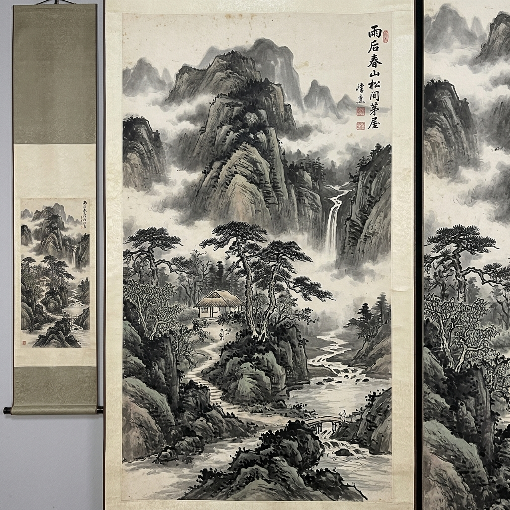
  →
  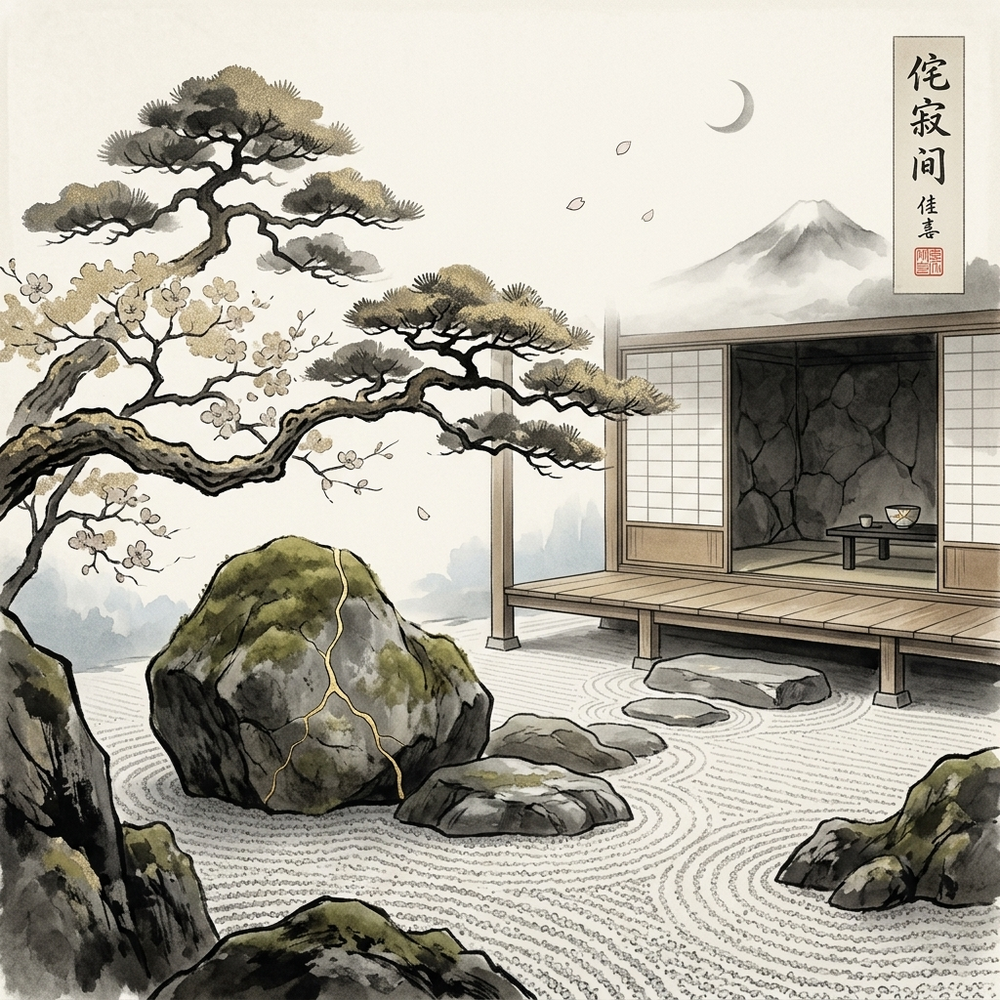
</p>
<p align="center"><em>Chinese Xieyi (0.915) → Japanese style transfer reference (0.932)</em></p>

---

## Evaluate — Three Modes

### Strict Mode (Judge)

<details>
<summary>See all 3 modes in action (GIF)</summary>
<p align="center">
  
</p>
</details>

Scores reflect tradition conformance with pass/fail indicators:

```
$ vulca evaluate artwork.png -t chinese_xieyi

  Score:     90%    Tradition: chinese_xieyi    Risk: low

    L1 Visual Perception         ██████████████████░░ 90%  ✓
    L2 Technical Execution       █████████████████░░░ 85%  ✓
    L3 Cultural Context          ██████████████████░░ 90%  ✓
    L4 Critical Interpretation   ████████████████████ 100%  ✓
    L5 Philosophical Aesthetics  ██████████████████░░ 90%  ✓
```

### Reference Mode (Advisor)

Cultural guidance with professional terminology — not a judge, a mentor:

```
$ vulca evaluate artwork.png -t chinese_xieyi --mode reference

  L2 Technical Execution  85%  (traditional)
     To push further: exploring a wider variety of texture strokes
     (e.g., axe-cut strokes 斧劈皴 for sharper rocks, or rain-drop
     strokes 雨点皴 for more rounded forms) could add further
     textural richness.

  L3 Cultural Context  95%  (traditional)
     To push further: adding a short poem (题画诗) that directly
     relates to the scene, further integrating the 'poetry-calligraphy-
     painting-seal' (诗书画印) harmony.
```

### Fusion Mode (Cross-Cultural Comparison)

Evaluate one artwork against multiple traditions simultaneously:

```
$ vulca evaluate artwork.png -t chinese_xieyi,japanese_traditional,western_academic --mode fusion

  Dimension                   Chinese Xieyi Japanese Tradit Western Academi
  ------------------------- --------------- --------------- ---------------
  Visual Perception                   90%             90%             10%
  Technical Execution                 90%             90%             10%
  Cultural Context                    95%             80%              0%
  Critical Interpretation            100%            100%             10%
  Philosophical Aesthetics            90%             90%             10%

  Overall Alignment                    93%             90%              8%

  Closest tradition: chinese_xieyi (93%)
```

| Dimension | What it measures |
|-----------|-----------------|
| **L1** Visual Perception | Composition, color harmony, spatial arrangement |
| **L2** Technical Execution | Rendering quality, technique fidelity, craftsmanship |
| **L3** Cultural Context | Tradition-specific motifs, canonical conventions |
| **L4** Critical Interpretation | Cultural sensitivity, contextual framing |
| **L5** Philosophical Aesthetics | Artistic depth, emotional resonance, spiritual qualities |

Each dimension returns: score (0-1), observations, rationale, actionable suggestion, reference technique, deviation type (traditional / intentional_departure / experimental).

---

## Layers V2 — Full Editing System

Every layer is **full-canvas RGBA** (not bbox crops). Proper blend modes. 3 split modes. 7 editing operations. 14 CLI subcommands.

<details>
<summary>See layer decomposition in action (GIF)</summary>
<p align="center">
  
</p>
</details>

### Split an Artwork into Layers

```
$ vulca layers split artwork.png -o ./layers/ --mode regenerate --provider gemini

  Splitting 6 layers (regenerate mode) -> ./layers/
    [0] background_paper       -> ./layers/background_paper.png
    [1] distant_mountains      -> ./layers/distant_mountains.png
    [2] mist_and_clouds        -> ./layers/mist_and_clouds.png
    [3] midground_landscape    -> ./layers/midground_landscape.png
    [4] pavilion_and_pine_trees -> ./layers/pavilion_and_pine_trees.png
    [5] calligraphy_and_seals  -> ./layers/calligraphy_and_seals.png
```

<p align="center">
  
  →
  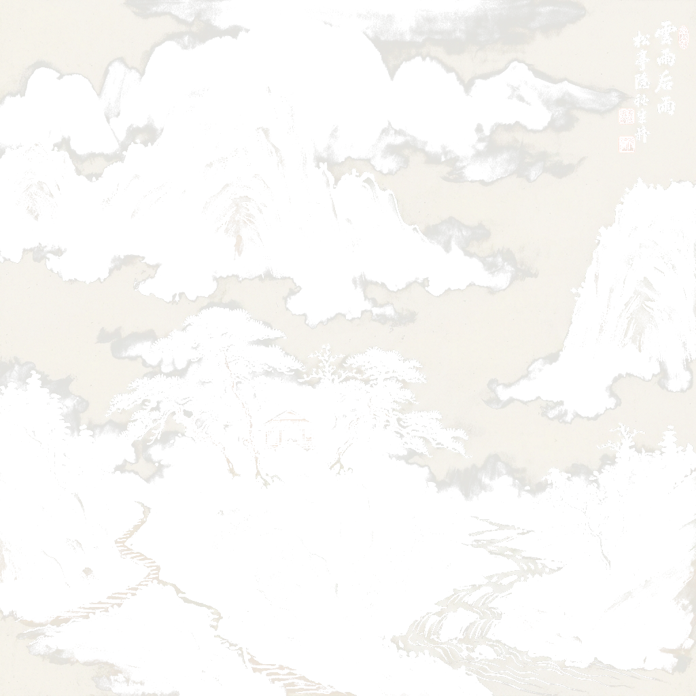
  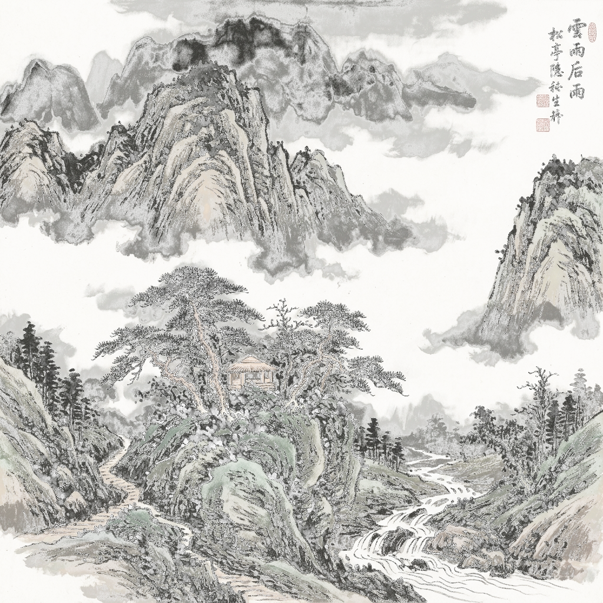
  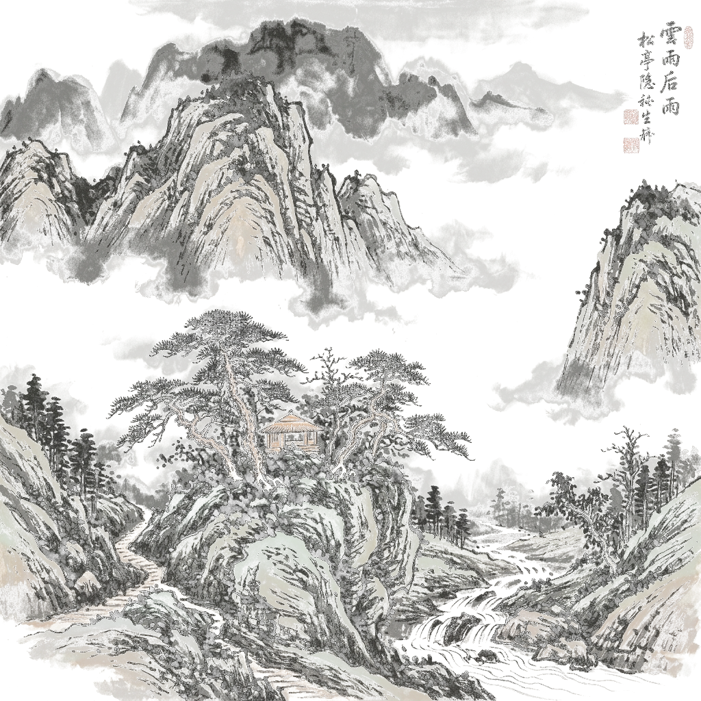
  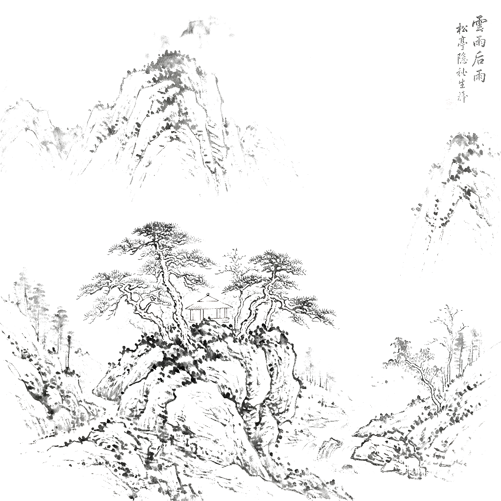
  →
  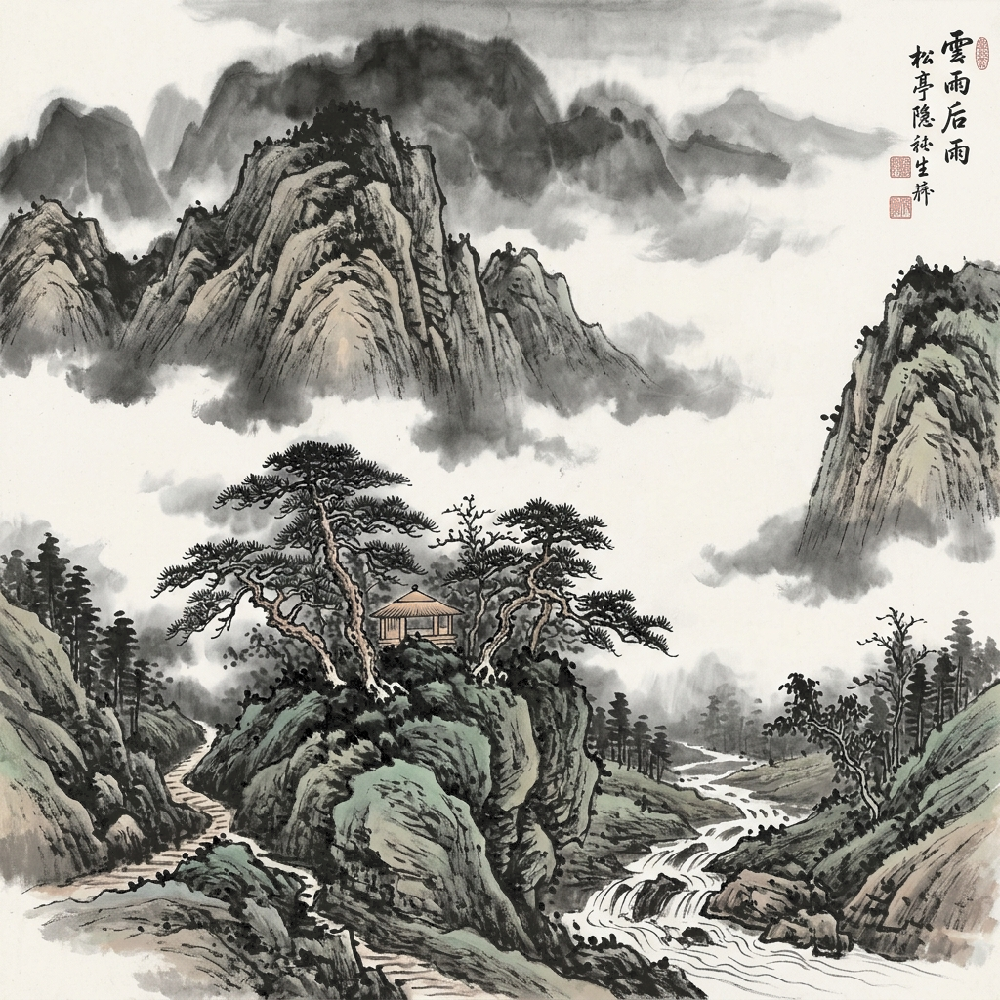
</p>

### Three Split Modes

| Mode | Command | How it works | API cost |
|------|---------|-------------|:--------:|
| **regenerate** (default) | `--mode regenerate` | img2img per layer via Gemini | ~$0.05/layer |
| **extract** | `--mode extract` | Color-range masking, no API | Free |
| **sam** | `--mode sam` | SAM2 pixel-precise masks | Free (local) |

### Edit Layers

```bash
vulca layers add ./layers/ --name "glow" --z-index 6 --content-type effect
vulca layers remove ./layers/ --layer calligraphy
vulca layers reorder ./layers/ --layer foreground --z-index 0
vulca layers toggle ./layers/ --layer mist --visible false
vulca layers lock ./layers/ --layer background
vulca layers merge ./layers/ --layers fg,mid --name merged
vulca layers duplicate ./layers/ --layer background --name bg_v2
```

### Redraw via img2img

```bash
# Single layer
vulca layers redraw ./layers/ --layer foreground -i "add autumn colors to the trees"

# Merge + redraw
vulca layers redraw ./layers/ --layers foreground,midground --merge -i "strengthen depth"
```

### Composite with Blend Modes

```bash
vulca layers composite ./layers/ -o final.png     # normal + screen + multiply
vulca layers export ./layers/ -o ./export.psd      # PNG directory per layer
vulca layers evaluate ./layers/ -t chinese_xieyi   # per-layer L1-L5 scoring
```

---

## Tools — Algorithmic Analysis (No API Required)

5 tools that run locally with zero API cost, using OpenCV and NumPy:

<details>
<summary>See all 5 tools in action (GIF)</summary>
<p align="center">
  
</p>
</details>

<p align="center">
  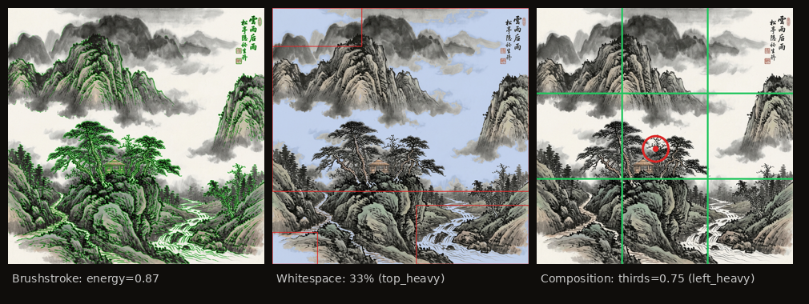
</p>

```
$ vulca tools run brushstroke_analyze --image artwork.png -t chinese_xieyi
  Brushstroke energy (0.87) aligns with chinese_xieyi's expressive style.
  Visible, dynamic strokes are consistent with tradition expectations.
  Confidence: 0.90

$ vulca tools run whitespace_analyze --image artwork.png -t chinese_xieyi
  Whitespace (32.8%) is within the chinese_xieyi ideal range (30%-55%).
  The top_heavy distribution aligns well with tradition expectations.
  Confidence: 0.75

$ vulca tools run composition_analyze --image artwork.png -t chinese_xieyi
  Rule-of-thirds alignment (0.75), left_heavy asymmetry aligns with
  chinese_xieyi's preference for asymmetric, dynamic arrangements.
  Confidence: 0.90
```

| Tool | What it detects | Zero API |
|------|----------------|:--------:|
| `brushstroke_analyze` | Stroke energy, edge density, direction | ✓ |
| `whitespace_analyze` | Negative space ratio, distribution | ✓ |
| `composition_analyze` | Rule of thirds, center weight, balance | ✓ |
| `color_gamut_check` | Saturation profiling + auto-fix mode | ✓ |
| `color_correct` | Color correction with check/fix/suggest | ✓ |

Hybrid pipeline: algorithmic tools run first, VLM evaluation covers remaining dimensions.

---

## Inpainting — Region-Based Repaint

Repaint specific regions while **guaranteeing pixel-level preservation** outside the bounding box. Not full-image regeneration — PIL local blend.

<p align="center">
  
  →
  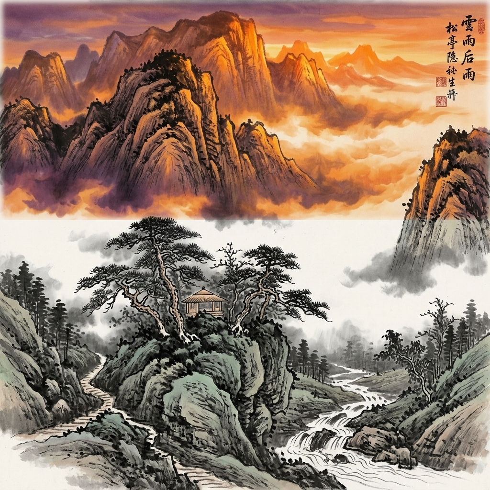
</p>
<p align="center"><em>Left: original | Right: sky region replaced with golden sunset (mountains untouched)</em></p>

```bash
# Natural language region description
vulca inpaint artwork.png --region "the sky in the upper portion" \
  --instruction "replace with dramatic stormy clouds" -t chinese_xieyi

# Or precise coordinates (x, y, w, h as percentages)
vulca inpaint artwork.png --region "0,0,100,40" \
  --instruction "add golden sunset gradient" --count 4 --select 1
```

How it works:
1. **Region detection**: NL description → VLM identifies bounding box, or use explicit coordinates
2. **Variant generation**: Generate N repaint variants for the region (default 4)
3. **Pixel-level blend**: Only pixels inside the bbox are replaced — everything outside is the original, untouched
4. **Selection**: Auto-select best variant or manually pick with `--select N`

```python
from vulca import ainpaint

result = await ainpaint(
    "artwork.png",
    region="the mountains in the background",
    instruction="make them more misty and ethereal",
    tradition="chinese_xieyi",
    count=4,
)
print(result.bbox)       # {"x": 0, "y": 10, "w": 100, "h": 45}
print(result.variants)   # [path1, path2, path3, path4]
print(result.blended)    # final blended output path
```

---

## Studio — Brief-Driven Creative Session

Multi-round creative collaboration with natural language control:

<details>
<summary>See studio workflow (GIF)</summary>
<p align="center">
  
</p>
</details>

<p align="center">
  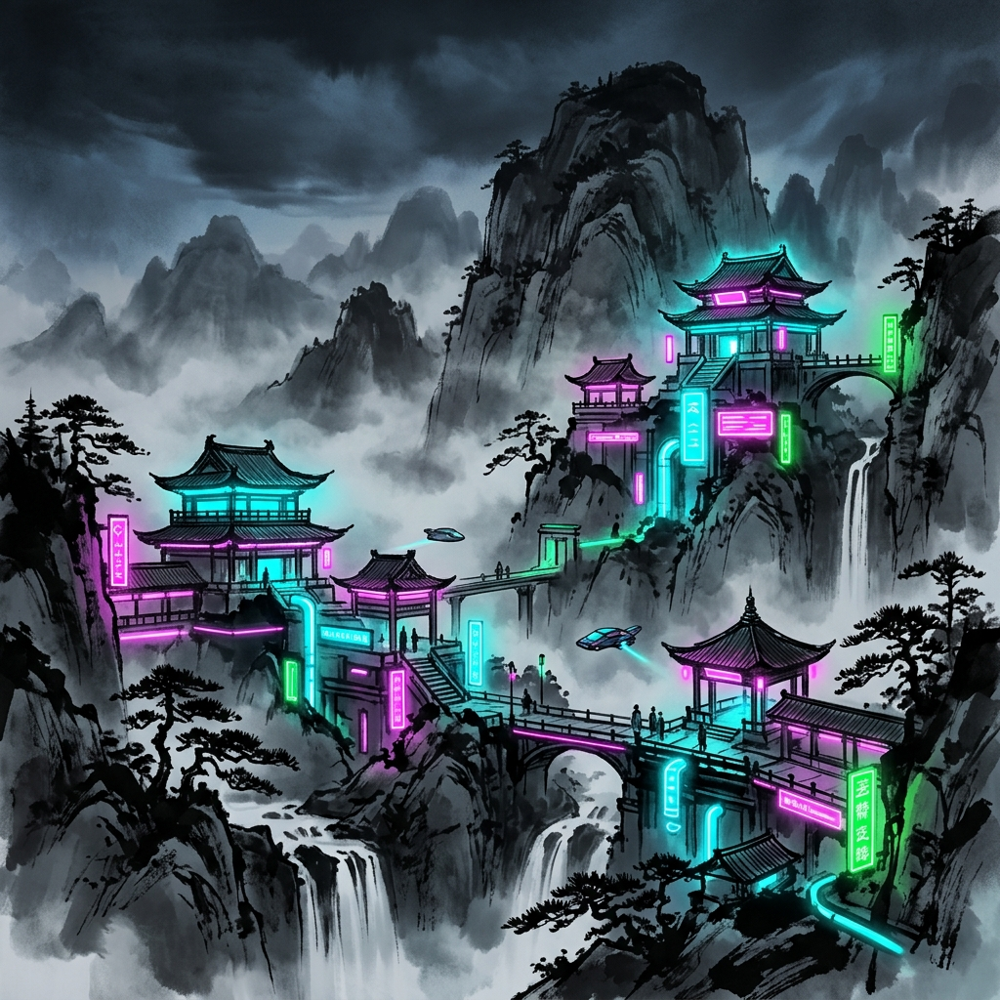
  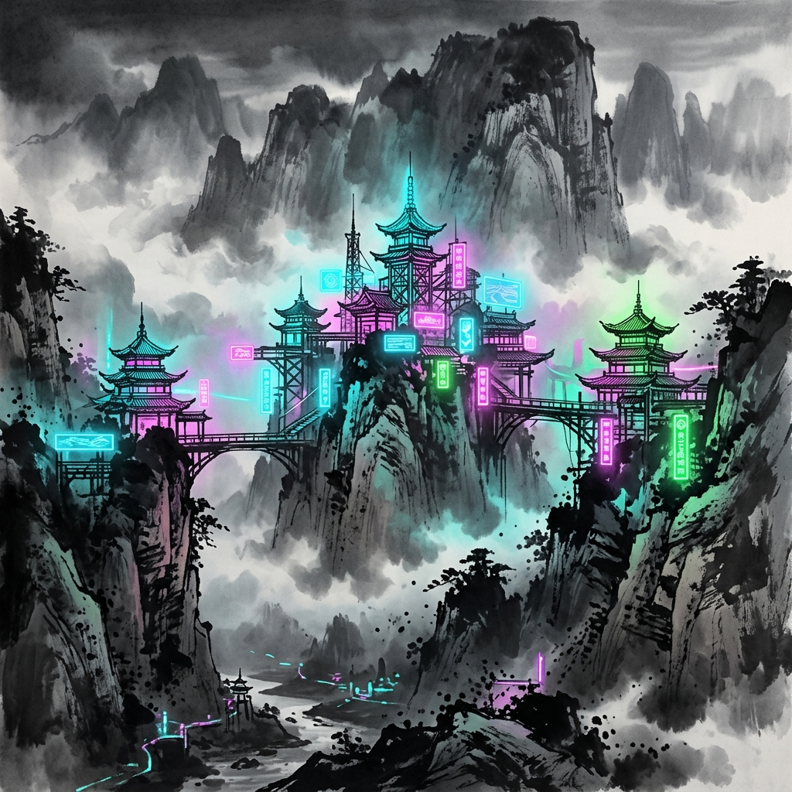
  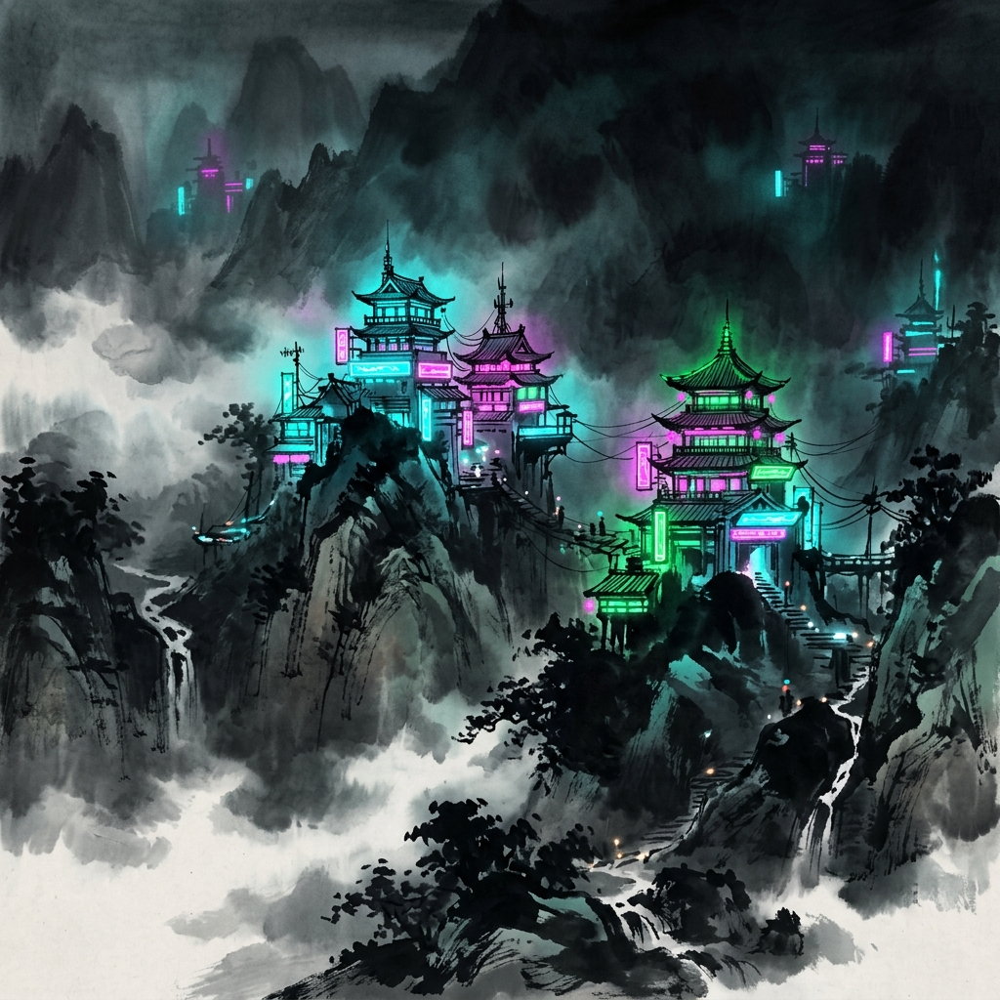
  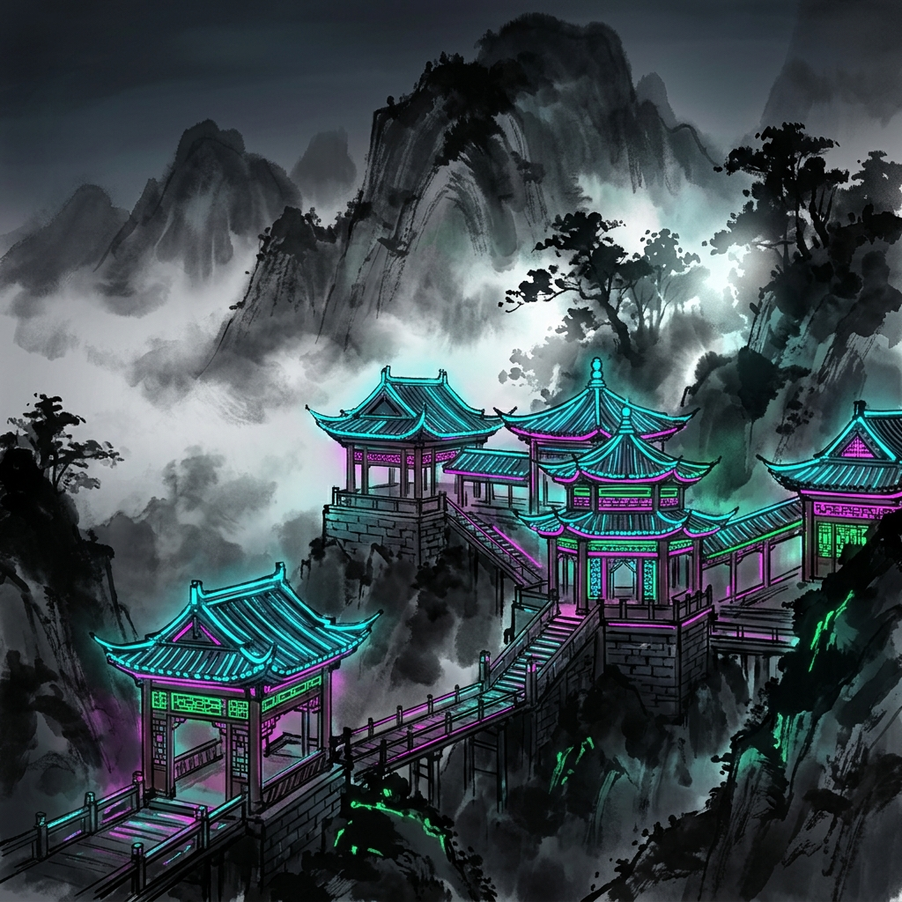
</p>
<p align="center"><em>4 concept variations from brief: "Cyberpunk ink wash, neon pavilions" → select best → generate → evaluate</em></p>

```
$ vulca studio "Cyberpunk ink wash neon pavilions in misty mountains" --provider gemini --auto

  Suggested styles: chinese_xieyi
  Style detected: chinese_xieyi (50%), cyberpunk (50%)

  [Concept] 4 concepts generated (831-921KB each)
  [Generate] Creating artwork via gemini...
  [Evaluate] L1-L5:
    L1 ███████████████████░ 95%
    L2 ██████████████████░░ 90%
    L3 █████████████████░░░ 85%
    L4 ████████████████████ 100%
    L5 ███████████████████░ 95%

  Score target reached (93%). Accepted.
```

```bash
# Interactive mode (with prompts at each step)
vulca studio "Zen garden at dawn" --provider gemini

# Non-interactive (scriptable, CI/CD friendly)
vulca studio "Zen garden at dawn" --provider gemini --auto --max-rounds 3

# Step by step
vulca brief ./project -i "Cyberpunk shanshui" -m "epic-futuristic"
vulca brief-update ./project "Add more negative space, reduce neon intensity"
vulca concept ./project -n 4 --provider gemini
vulca concept ./project --select 1
```

---

## Self-Evolution

The system learns from every session. After 1100+ sessions, weights evolve per tradition:

```
$ vulca evolution chinese_xieyi

  Dim     Original    Evolved     Change
  ----- ---------- ---------- ----------
  L1        10.0%     10.0% +    0.0%
  L2        15.0%     20.0% +    5.0%    ← Technical Execution strengthened
  L3        25.0%     35.0% +   10.0%    ← Cultural Context most evolved
  L4        20.0%     15.0%    -5.0%
  L5        30.0%     20.0%   -10.0%
  Sessions: 71
```

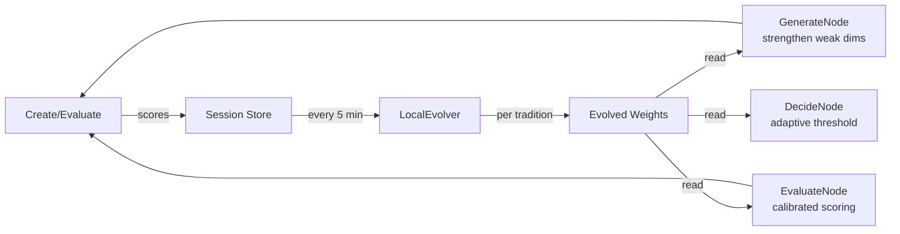
```mermaid
graph LR
    C[Create/Evaluate] -->|scores| S[Session Store]
    S -->|every 5 min| LE[LocalEvolver]
    LE -->|per tradition| EW[Evolved Weights]
    EW -->|read| G[GenerateNode<br/>strengthen weak dims]
    EW -->|read| E[EvaluateNode<br/>calibrated scoring]
    EW -->|read| D[DecideNode<br/>adaptive threshold]
    G --> C
    E --> C
```

**How users interact with evolution:**

```bash
# View current evolved state for any tradition
vulca evolution chinese_xieyi

# Compare multiple traditions
vulca evolution default
vulca evolution japanese_traditional

# Evolution happens automatically — every create/evaluate session
# contributes to weight refinement. No manual intervention needed.

# Session data:
vulca sessions stats    # 1100+ sessions, per-tradition breakdown
vulca sessions list -t chinese_xieyi --sort score  # browse by tradition
```

**Key design choices:**
- `strict` mode sessions strengthen tradition conformance weights
- `reference` mode sessions track exploration trends without penalizing
- `deviation_type=intentional_departure` is not treated as a weakness
- Weights converge after ~50 sessions per tradition

---

## Where to Use

### Claude Code / Cursor (MCP Plugin)

```bash
pip install vulca[mcp]
claude plugin install vulca-org/vulca-plugin
```

Then ask: *"Evaluate this painting for Chinese xieyi style"* — Claude calls VULCA automatically.

21 MCP tools: `evaluate_artwork`, `create_artwork`, `analyze_layers`, `layers_split`, `layers_redraw`, `layers_edit` (7 operations), `studio_create_brief`, `inpaint_artwork`, 5 Tool Protocol tools, and more.

### ComfyUI

```bash
# In ComfyUI/custom_nodes/
git clone https://github.com/vulca-org/comfyui-vulca
pip install vulca>=0.9.2
```

11 nodes: Brief, Concept, Generate, Evaluate, Update, Inpaint, Layers Analyze/Composite/Export, Evolution, Traditions.

### Python SDK

```python
import vulca

# Evaluate
result = vulca.evaluate("artwork.png", tradition="chinese_xieyi")
print(result.score)        # 0.90
print(result.suggestions)  # {"L2": "explore axe-cut strokes...", ...}
print(result.L3)           # 0.95

# Create
result = vulca.create("Tea packaging with mountain landscape",
                       provider="gemini", tradition="brand_design")
print(result.weighted_total)  # 0.88
print(result.best_image_b64[:20])  # base64 image data

# Sparse evaluation (only relevant dimensions)
result = vulca.evaluate("artwork.png", tradition="chinese_xieyi",
                         sparse=True, intent="文化传统符号")
print(result.sparse_activation)  # {"active": {"L3": 0.9, ...}, "skipped": {...}}

# Layers
from vulca.layers import analyze_layers, split_extract, composite_layers
import asyncio
layers = asyncio.run(analyze_layers("artwork.png"))
results = split_extract("artwork.png", layers, output_dir="./layers")
composite_layers(results, width=1024, height=1024, output_path="composite.png")
```

### CLI Reference

```bash
vulca evaluate painting.jpg -t chinese_xieyi                    # strict mode
vulca evaluate painting.jpg -t chinese_xieyi --mode reference   # advisor mode
vulca evaluate painting.jpg -t xieyi,japanese --mode fusion     # cross-cultural
vulca evaluate painting.jpg --sparse-eval                       # only relevant dims

vulca create "Misty mountains" -t chinese_xieyi --provider gemini -o art.png
vulca create "Tea packaging" --provider gemini --residuals       # agent attention weights

vulca studio "Zen garden" --provider gemini                      # interactive
vulca studio "Zen garden" --provider gemini --auto               # non-interactive

vulca layers analyze artwork.png                                 # VLM semantic analysis
vulca layers split artwork.png -o ./layers --mode regenerate     # 3 modes
vulca layers redraw ./layers --layer sky -i "add sunset"         # img2img
vulca layers add ./layers --name glow --content-type effect      # 7 editing ops
vulca layers composite ./layers -o final.png                     # blend modes

vulca inpaint artwork.png --region "sky" --instruction "add dramatic clouds"
vulca tools run brushstroke_analyze --image art.png -t chinese_xieyi
vulca evolution chinese_xieyi                                    # evolved weights
vulca sessions stats                                             # 1100+ sessions
vulca resume <session-id>                                        # resume checkpoint
```

---

## 13 Cultural Traditions

`chinese_xieyi` `chinese_gongbi` `japanese_traditional` `western_academic` `islamic_geometric` `watercolor` `african_traditional` `south_asian` `contemporary_art` `photography` `brand_design` `ui_ux_design` + `default`

Custom traditions via YAML:

```bash
vulca evaluate painting.jpg --tradition ./my_style.yaml
```

---

## Install

```bash
pip install vulca           # core SDK + CLI
pip install vulca[mcp]      # + MCP server for Claude Code / Cursor
pip install vulca[sam]      # + SAM2 pixel-precise layer extraction
```

No API key required for mock mode. For real VLM scoring + image generation:

```bash
export GOOGLE_API_KEY=your-key
```

Gemini image generation supports **512 / 1K / 2K / 4K** output with automatic size and aspect ratio mapping.

---

## Citation

```bibtex
@inproceedings{yu2025vulca,
  title={VULCA: A Framework for Culturally-Aware Visual Understanding},
  author={Yu, Haorui},
  booktitle={Findings of EMNLP 2025},
  year={2025}
}
```

## License

Apache 2.0

---

> Issues and PRs welcome. Development happens in a private monorepo and is synced here via `git subtree`.
