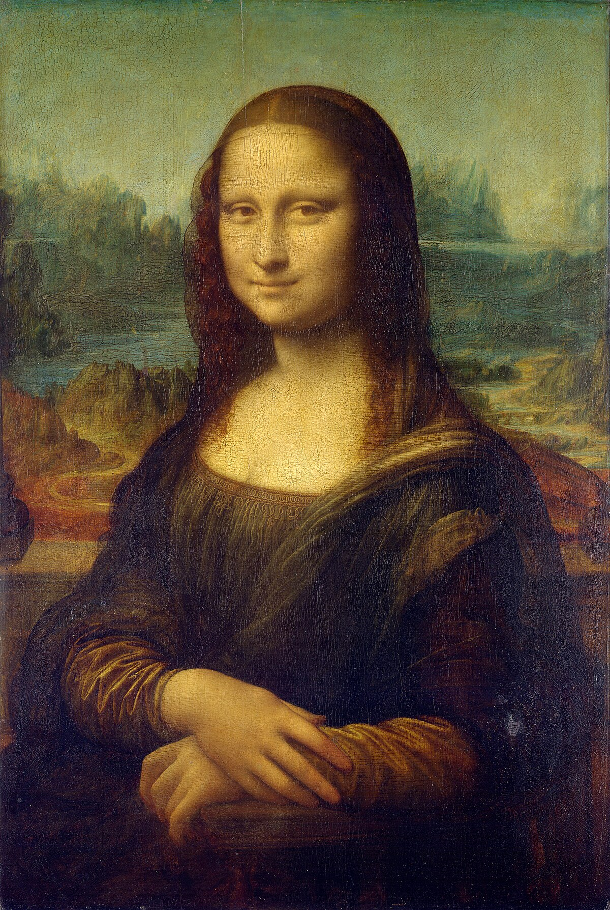
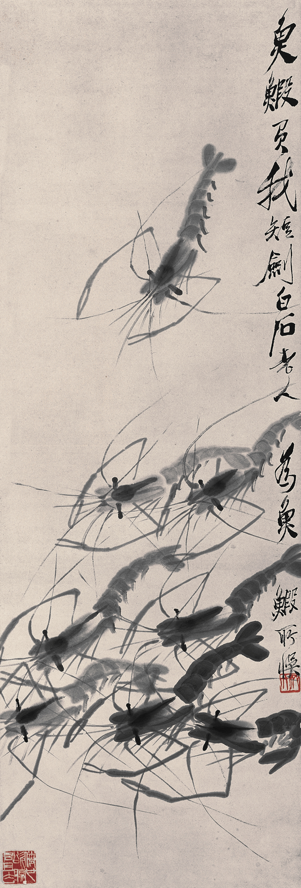
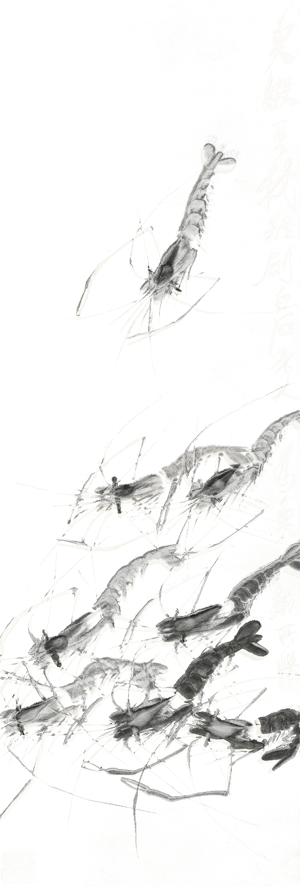

# VULCA

[](https://pypi.org/project/vulca/)
[](https://pypi.org/project/vulca/)
[](https://github.com/vulca-org/vulca/blob/master/LICENSE)
[](https://github.com/vulca-org/vulca-plugin)

**Agents can plan image edits but can't cut pixels. Vulca is the hands — semantic layer splits, cultural scoring, inpainting — as 21 MCP tools for Claude Code.**

> *Below: Mona Lisa → `face_and_hair.png` + `body_and_dress.png`, decomposed locally on Apple Silicon (ComfyUI + Ollama) with zero cloud API calls. SDK total: 21 MCP tools · 1446 tests passing.*

## What happens when you run `/decompose`

```
> /decompose assets/mona_lisa.jpg

Claude: I'll first look at the image and plan a decomposition.
[tool_use: view_image(path="assets/mona_lisa.jpg")]
[tool_use: layers_split(
    path="assets/mona_lisa.jpg",
    mode="orchestrated",
    plan={"domain": "portrait", "entities": [
        {"name": "face_and_hair", "prompt": "the woman's face and hair"},
        {"name": "body_and_dress", "prompt": "the woman's body and dress"}]})]
[tool_result: {"layers": [
    {"name": "face_and_hair", "path": "./layers/face_and_hair.png", "coverage": 0.38},
    {"name": "body_and_dress", "path": "./layers/body_and_dress.png", "coverage": 0.54}]}]

Claude: Two layers extracted with 92% total coverage. Want to redraw one?
```

## Try it in 60 seconds

**Prerequisite:** [`uv` installed](https://docs.astral.sh/uv/getting-started/installation/?utm_source=github-readme&utm_medium=oss&utm_campaign=refresh-2026-04-20) (provides `uvx`). Without `uv`, substitute `uvx --from vulca[mcp] vulca-mcp` with `python -m vulca.mcp_server` in Path B.

### Path A — plugin install (recommended)

```bash
pip install vulca[mcp]==0.16.1
claude plugin install vulca-org/vulca-plugin
```

Then in Claude Code: `> /decompose /path/to/your_image.jpg`

### Path B — no plugin (power user)

```bash
pip install vulca[mcp]==0.16.1

# Register MCP server — add to ~/.claude/settings.json:
# {"mcpServers": {"vulca": {"command": "uvx", "args": ["--from", "vulca[mcp]==0.16.1", "vulca-mcp"]}}}

# Install the /decompose skill:
mkdir -p ~/.claude/skills/decompose
curl -o ~/.claude/skills/decompose/SKILL.md \
  "https://raw.githubusercontent.com/vulca-org/vulca/v0.16.1/.claude/skills/decompose/SKILL.md?utm_source=github-readme&utm_medium=oss&utm_campaign=refresh-2026-04-20"
```

<p align="center">
  
  →
  
  
</p>
<p align="center"><em>Mona Lisa → face & hair / body & dress — clean semantic separation, produced by the transcript above</em></p>

---

## Why agent-native

Most image SDKs ship a "brain" — a VLM planner that decides what to generate, how to compose, when to stop. Claude Code already has a brain. What it can't do is cut pixels: run SAM + YOLO + DINO + SegFormer, diff masks, score against a cultural rubric, composite with alpha. Vulca is the **hands**, not another brain.

Practical consequences of this framing:
- **Tools return structured JSON + paths**, not prose. The agent inspects, branches, retries.
- **No hidden decisions** inside tools — every planning step is visible to the agent and can be rolled back.
- **Skills (`.claude/skills/*`) are declarative prompts, not wrappers.** The agent reads the skill, the agent executes.
- **Local-first is a first-class path** — ComfyUI + Ollama + MPS tested end-to-end; no cloud key required.

---

## What Vulca takes off your agent's hands

| Cluster | What your agent delegates to Vulca | Skill | Tools |
|---|---|:---:|---|
| **Decompose** | Extract 10–20 semantic layers from any image with real transparency. | ✅ `/decompose` | `layers_split` (orchestrated), `layers_list` |
| **Edit** | Redraw one region or one layer without touching the rest. Composite back. | Roadmap | `inpaint_artwork`, `layers_edit`, `layers_redraw`, `layers_transform`, `layers_composite`, `layers_export`, `layers_evaluate` |
| **Evaluate** | Judge a visual against L1–L5 cultural criteria over 13 traditions with citable rationale. | Roadmap | `evaluate_artwork`, `list_traditions`, `get_tradition_guide`, `search_traditions` |
| **Create** | Generate a new image from intent + tradition guidance, optionally in structured layers. | — | `create_artwork`, `generate_image` |
| **Brief / Studio** | Turn a creative brief into concept sketches and iterate. | — | `brief_parse`, `generate_concepts` |
| **Admin** | Let the agent see intermediate artifacts, unload models, archive sessions. | — | `view_image`, `unload_models`, `archive_session`, `sync_data` |

```
User intent ─▶ Claude Code (planning) ─▶ Vulca MCP tools ─▶ Image artifacts ─┐
       ▲                                                                    │
       └──────────── visible via view_image ◀───────────────────────────────┘
```

### Roadmap — no promises, just honest order

- **Next skill:** `/evaluate` — reactivates the EMNLP anchor for agent-driven cultural scoring
- **Then:** `/inpaint` (region-level edit), `/layered-create` (structured generation)
- **Beyond:** community-driven — file an issue with your workflow

See [docs/agent-native-workflow.md](docs/agent-native-workflow.md) for the deeper walkthrough.

---

<details>
<summary><strong>Evaluate — three modes (L1–L5 cultural scoring)</strong></summary>

Beyond decomposition, Vulca evaluates any image against a cultural tradition across 5 dimensions (L1 Visual Perception, L2 Technical Execution, L3 Cultural Context, L4 Critical Interpretation, L5 Philosophical Aesthetics) in three modes. The MCP tool is `evaluate_artwork`; the CLI is `vulca evaluate`. No agent skill yet — **`/evaluate` is next on the roadmap**.

### Strict (binary cultural judgment)

```
$ vulca evaluate artwork.png -t chinese_xieyi

  Score:     90%    Tradition: chinese_xieyi    Risk: low
    L1 Visual Perception         90%  ✓
    L2 Technical Execution       85%  ✓
    L3 Cultural Context          90%  ✓
    L4 Critical Interpretation  100%  ✓
    L5 Philosophical Aesthetics  90%  ✓
```

### Reference (mentor — professional terminology, not a verdict)

```
$ vulca evaluate artwork.png -t chinese_xieyi --mode reference

  L3 Cultural Context          95%  (traditional)
     To push further: adding a poem (题画诗) for poetry-calligraphy-
     painting-seal (诗书画印) harmony.
```

### Fusion (cross-tradition comparison)

```
$ vulca evaluate artwork.png -t chinese_xieyi,japanese_traditional,western_academic --mode fusion

  Dimension                Chinese Xieyi  Japanese Trad  Western Acad
  Overall Alignment               93%            90%           8%

  Closest tradition: chinese_xieyi (93%)
```

</details>

<details>
<summary><strong>Structured creation — <code>--layered</code> mode</strong></summary>

Vulca can plan a layer structure from a tradition's knowledge and emit each layer as a separate transparent PNG, with the first layer serving as a style anchor for the rest (Defense 3, v0.14+).

```bash
vulca create "水墨山水，松间茅屋" -t chinese_xieyi --layered --provider comfyui
# → 5 layers: paper, distant_mountains, mountains_pines, hut_figure, calligraphy
```

Works across traditions — photography produces depth layers, gongbi produces line-art + wash layers, brand design produces logo + background + typography.

```python
import vulca
result = vulca.create("水墨山水", provider="comfyui", tradition="chinese_xieyi", layered=True)
for layer in result.layers:
    print(layer.name, layer.path, layer.coverage)
```

From an agent, invoke via the `create_artwork` MCP tool (Path A/B above). The `/layered-create` skill is on the roadmap.

</details>

<details>
<summary><strong>Inpaint + layer editing — pixel-level preservation outside the target</strong></summary>

Two orthogonal flows for targeted change:

**Region inpaint** (no decomposition — pick a region, regenerate only that area):

```bash
vulca inpaint artwork.png --region "the sky in the upper portion" \
  --instruction "dramatic stormy clouds" -t chinese_xieyi --provider comfyui
```

**Layer redraw** (after `/decompose` — swap one layer without touching the rest):

```bash
vulca layers lock ./layers/ --layer calligraphy_and_seals
vulca layers redraw ./layers/ --layer background_sky \
  -i "warm golden sunset with orange and purple gradients"
vulca layers composite ./layers/ -o final.png
```

Layer operations available: `add`, `remove`, `reorder`, `toggle`, `lock`, `merge`, `duplicate`. All provider-agnostic (works with ComfyUI, Gemini, OpenAI, mock).

From an agent, these map to `inpaint_artwork`, `layers_edit`, `layers_redraw`, `layers_composite`, `layers_export`. The `/inpaint` skill is on the roadmap.

</details>

---

## Research

| Paper | Venue | Contribution |
|-------|-------|--------------|
| [**VULCA Framework**](https://aclanthology.org/2025.findings-emnlp.103/?utm_source=github-readme&utm_medium=oss&utm_campaign=refresh-2026-04-20) | EMNLP 2025 Findings | 5-dimension evaluation framework for culturally-situated multimodal LLM tasks |
| [**VULCA-Bench**](https://arxiv.org/abs/2601.07986?utm_source=github-readme&utm_medium=oss&utm_campaign=refresh-2026-04-20) | arXiv | L1–L5 definitions, 7,410 samples, 9 traditions |
| [**Art Critique**](https://arxiv.org/abs/2601.07984?utm_source=github-readme&utm_medium=oss&utm_campaign=refresh-2026-04-20) | arXiv | Cross-cultural expert-level critique evaluation with VLMs |

### Citation

```bibtex
@inproceedings{yu2025vulca,
  title     = {A Structured Framework for Evaluating and Enhancing Interpretive
               Capabilities of Multimodal LLMs in Culturally Situated Tasks},
  author    = {Yu, Haorui and Ruiz-Dolz, Ramon and Yi, Qiufeng},
  booktitle = {Findings of the Association for Computational Linguistics: EMNLP 2025},
  pages     = {1945--1971},
  year      = {2025}
}

@article{yu2026vulcabench,
  title   = {VULCA-Bench: A Benchmark for Culturally-Aware Visual Understanding at Five Levels},
  author  = {Yu, Haorui},
  journal = {arXiv preprint arXiv:2601.07986},
  year    = {2026}
}
```

---

## 13 cultural traditions

`chinese_xieyi` `chinese_gongbi` `japanese_traditional` `western_academic` `islamic_geometric` `watercolor` `african_traditional` `south_asian` `contemporary_art` `photography` `brand_design` `ui_ux_design` `default`

Custom traditions via YAML — `vulca evaluate painting.jpg --tradition ./my_style.yaml`.

---

## Apple Silicon / MPS quickstart

```bash
pip install vulca[mcp,tools]==0.16.1
# Local stack: ComfyUI + Ollama, full MPS support
```

See [docs/apple-silicon-mps-comfyui-guide.md](docs/apple-silicon-mps-comfyui-guide.md) for the full [ComfyUI](https://github.com/comfyanonymous/ComfyUI?utm_source=github-readme&utm_medium=oss&utm_campaign=refresh-2026-04-20) + Ollama setup tested on MPS.

---

<details>
<summary>CLI / SDK cheat sheet</summary>

```bash
# Create
vulca create "intent" -t tradition --provider mock|gemini|openai|comfyui
  --layered                    # structured layer generation
  --hitl                       # pause for human review
  --reference ref.png          # reference image
  --colors "#hex1,#hex2"       # color palette constraint
  -o output.png

# Evaluate
vulca evaluate image.png -t tradition --mode strict|reference|fusion
  --skills brand,audience,trend  # extra commercial scoring skills

# Layers (all 14 subcommands)
vulca layers analyze image.png
vulca layers split image.png -o dir --mode extract|regenerate|sam
vulca layers redraw dir --layer name -i "instruction"
vulca layers add dir --name name --content-type type
vulca layers toggle dir --layer name --visible true|false
vulca layers lock dir --layer name
vulca layers merge dir --layers a,b --name merged
vulca layers duplicate dir --layer name
vulca layers composite dir -o output.png
vulca layers export dir -o output.psd
vulca layers evaluate dir -t tradition
vulca layers regenerate dir --provider gemini

# Inpainting
vulca inpaint image.png --region "description or x,y,w,h"
  --instruction "what to change" -t tradition --count 4 --select 1

# Tools (algorithmic, no API cost)
vulca tools run brushstroke_analyze --image art.png -t chinese_xieyi
vulca tools run whitespace_analyze --image art.png -t chinese_xieyi
vulca tools run composition_analyze --image art.png -t chinese_xieyi
vulca tools run color_gamut_check --image art.png -t chinese_xieyi
vulca tools run color_correct --image art.png -t chinese_xieyi

# Utilities
vulca traditions                        # list all traditions
vulca tradition tradition_name          # detailed guide
vulca tradition --init my_style         # generate template YAML
vulca evolution tradition_name          # check evolved weights
vulca sync [--push-only|--pull-only]    # cloud sync
```

```python
# Python SDK
import vulca
result = vulca.evaluate("artwork.png", tradition="chinese_xieyi")
print(result.score, result.suggestions, result.L3)

# Structured creation
result = vulca.create("水墨山水", provider="comfyui",
                      tradition="chinese_xieyi", layered=True)

# Layer operations
from vulca.layers import analyze_layers, split_extract, composite_layers
import asyncio
layers = asyncio.run(analyze_layers("artwork.png"))
results = split_extract("artwork.png", layers, output_dir="./layers")
composite_layers(results, width=1024, height=1024, output_path="composite.png")

# Self-evolution weights
weights = vulca.get_weights("chinese_xieyi")
# → {"L1": 0.10, "L2": 0.20, "L3": 0.35, "L4": 0.15, "L5": 0.20}
```

</details>

<details>
<summary>Architecture</summary>

```
┌──────────────────────────────────────────────────────────────┐
│                         User Intent                          │
└──────┬───────────┬──────────────┬──────────────┬─────────────┘
       │           │              │              │
  ┌────▼──┐  ┌─────▼───┐  ┌──────▼─────┐  ┌─────▼─────┐
  │  CLI  │  │ Python  │  │    MCP     │  │  ComfyUI  │
  │       │  │   SDK   │  │  21 tools  │  │  11 nodes │
  └───┬───┘  └────┬────┘  └──────┬─────┘  └─────┬─────┘
      └───────────┴───────┬──────┴───────────────┘
                          │
                 vulca.pipeline.execute()
                          │
              ┌───────────▼───────────┐
              │    Image Providers    │
              │  ComfyUI │ Gemini     │
              │  OpenAI  │ Mock       │
              └───────────────────────┘
```

| Provider | Generate | Inpaint | Layered | Multilingual |
|----------|----------|---------|---------|--------------|
| ComfyUI  | ✓        | ✓       | ✓       | English-only |
| Gemini   | ✓        | ✓       | ✓       | CJK native   |
| OpenAI   | ✓        | —       | —       | English-only |
| Mock     | ✓        | ✓       | ✓       | —            |

All 8 end-to-end pipeline phases validated on the local stack (ComfyUI + Ollama, Apple Silicon MPS). See the MPS guide linked above.

</details>

<details>
<summary>Self-evolution (how weights drift per tradition over sessions)</summary>

Every session feeds back into the tradition's L1–L5 weights. Gating: minimum 5 sessions + 3 feedback sessions before weights shift. `strict` mode reinforces conformance, `reference` mode tracks exploration.

```
$ vulca evolution chinese_xieyi

  Dim     Original    Evolved     Change
  L1        10.0%     10.0%      0.0%
  L2        15.0%     20.0%     +5.0%    ← Technical Execution strengthened
  L3        25.0%     35.0%    +10.0%    ← Cultural Context most evolved
  L4        20.0%     15.0%     -5.0%
  L5        30.0%     20.0%    -10.0%
  Sessions: 71
```

From an agent: the `evaluate_artwork` MCP tool returns evolved weights alongside scores; no separate skill needed.

</details>

---

## Showcase — agent-produced layer separations

<p align="center">
  
  →
  
  
  
</p>
<p align="center"><em>Qi Baishi's Shrimp → shrimp / calligraphy / seals — each on transparent canvas.<br/>These layer separations were produced by Claude Code driving Vulca MCP tools via <code>/decompose</code>.</em></p>

---

## Support

- **Issues:** [github.com/vulca-org/vulca/issues](https://github.com/vulca-org/vulca/issues) — bug reports, feature requests, workflow needs that should become a skill
- **Plugin:** [vulca-org/vulca-plugin](https://github.com/vulca-org/vulca-plugin) — version-tracked with the SDK; install via `claude plugin install`
- **Skill source:** [`.claude/skills/decompose/SKILL.md`](.claude/skills/decompose/SKILL.md) in this repo — the only source of truth for the `/decompose` flow

## License

Apache 2.0. See [LICENSE](LICENSE).

> Issues and PRs welcome. Development syncs from a private monorepo via `git subtree`.
