# VULCA

[](https://pypi.org/project/vulca/)
[](https://pypi.org/project/vulca/)
[](https://github.com/vulca-org/vulca/blob/main/LICENSE)
[]()
[]()

**AI-native cultural art creation organism.** Create, evaluate, and evolve artwork across 13 cultural traditions — L1-L5 scoring, self-evolving weights, full layer editing, and 5 algorithmic analysis tools. 21 MCP tools, all from one `pip install`.

<p align="center">
  
  
  
</p>

```bash
pip install vulca
export GOOGLE_API_KEY=your-key
vulca create "Misty mountains after rain, pine pavilion in clouds" -t chinese_xieyi -o artwork.png
# → Score: 0.915 | Tradition: chinese_xieyi | 1 round | 43s
# → Image: artwork.png
```

<details>
<summary><strong>See it in action</strong> (GIF)</summary>
<p align="center">
  
</p>
</details>

> Based on peer-reviewed research: [VULCA Framework](https://aclanthology.org/2025.findings-emnlp/) (EMNLP 2025 Findings) and [VULCA-Bench](https://arxiv.org/abs/2601.07986) (7,410 samples, 9 traditions).

---

## Architecture

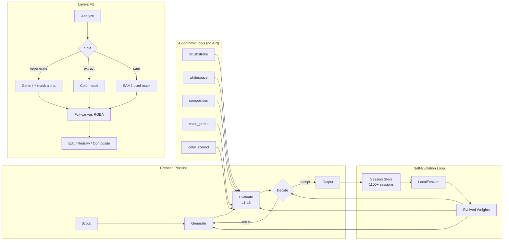

**4 entry points, 1 engine**: CLI, Python SDK, MCP (21 tools), ComfyUI (11 nodes) — all share `vulca.pipeline.execute()`.

---

## Create

<details>
<summary>See create + evaluate workflow (GIF)</summary>
<p align="center">
  
</p>
</details>

```bash
vulca create "Misty mountains after rain" -t chinese_xieyi -o landscape.png
vulca create "Tea packaging, Eastern aesthetics" -t brand_design --colors "#C87F4A,#5F8A50"
vulca create "Zen garden" -t japanese_traditional --provider gemini --hitl  # pause for review
```

### Layer-Driven Design Transfer

Extract elements from artwork, transform into new designs while maintaining cultural consistency:

```bash
# 1. Extract mountain layer from ink wash painting
vulca layers split landscape.png -o ./layers/ --mode extract
# 2. Use the mountain layer as reference → create brand packaging
vulca create "Premium tea packaging, mountain silhouette as watermark" \
  -t brand_design --reference ./layers/distant_mountains.png
# → Score: 0.92
```

<p align="center">
  
  →
  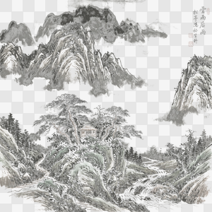
  →
  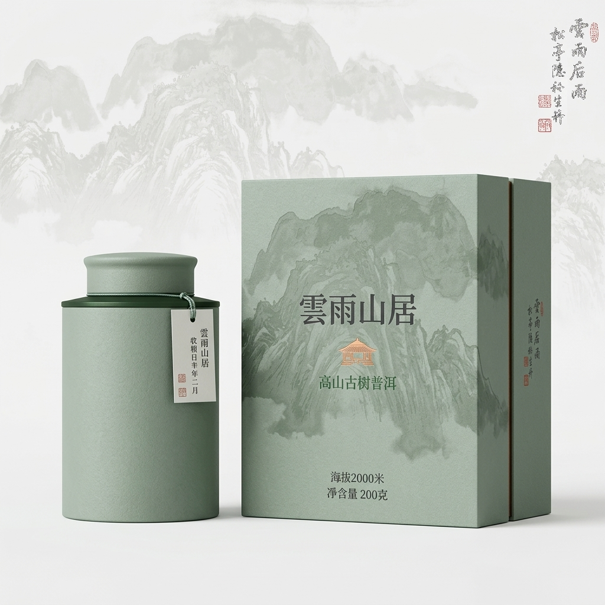
</p>
<p align="center"><em>Ink wash landscape → extract mountain layer (checkerboard = transparent) → tea packaging (92%)</em></p>

---

## Evaluate — Three Modes

### Strict Mode (Judge)

```
$ vulca evaluate artwork.png -t chinese_xieyi

  Score:     90%    Tradition: chinese_xieyi    Risk: low

    L1 Visual Perception         ██████████████████░░ 90%  ✓
    L2 Technical Execution       █████████████████░░░ 85%  ✓
    L3 Cultural Context          ██████████████████░░ 90%  ✓
    L4 Critical Interpretation   ████████████████████ 100%  ✓
    L5 Philosophical Aesthetics  ██████████████████░░ 90%  ✓
```

### Reference Mode (Advisor)

Cultural guidance with professional terminology — not a judge, a mentor:

```
$ vulca evaluate artwork.png -t chinese_xieyi --mode reference

  L2 Technical Execution  85%  (traditional)
     To push further: exploring texture strokes — axe-cut (斧劈皴)
     for sharper rocks, rain-drop (雨点皴) for rounded forms.

  L3 Cultural Context  95%  (traditional)
     To push further: adding a poem (题画诗) for poetry-calligraphy-
     painting-seal (诗书画印) harmony.
```

### Fusion Mode (Cross-Cultural Comparison)

```
$ vulca evaluate artwork.png -t chinese_xieyi,japanese_traditional,western_academic --mode fusion

  Dimension                   Chinese Xieyi Japanese Tradit Western Academi
  Visual Perception                   90%             90%             10%
  Technical Execution                 90%             90%             10%
  Cultural Context                    95%             80%              0%
  Critical Interpretation            100%            100%             10%
  Philosophical Aesthetics            90%             90%             10%
  Overall Alignment                    93%             90%              8%

  Closest tradition: chinese_xieyi (93%)
```

| Dimension | What it measures |
|-----------|-----------------|
| **L1** Visual Perception | Composition, color harmony, spatial arrangement |
| **L2** Technical Execution | Rendering quality, technique fidelity, craftsmanship |
| **L3** Cultural Context | Tradition-specific motifs, canonical conventions |
| **L4** Critical Interpretation | Cultural sensitivity, contextual framing |
| **L5** Philosophical Aesthetics | Artistic depth, emotional resonance, spiritual qualities |

---

## Layers V2

Every layer is **full-canvas RGBA** with real transparency. Proper blend modes (normal/screen/multiply). 14 CLI subcommands.

<details>
<summary>See layer decomposition in action (GIF)</summary>
<p align="center">
  
</p>
</details>

<p align="center">
  
  →
  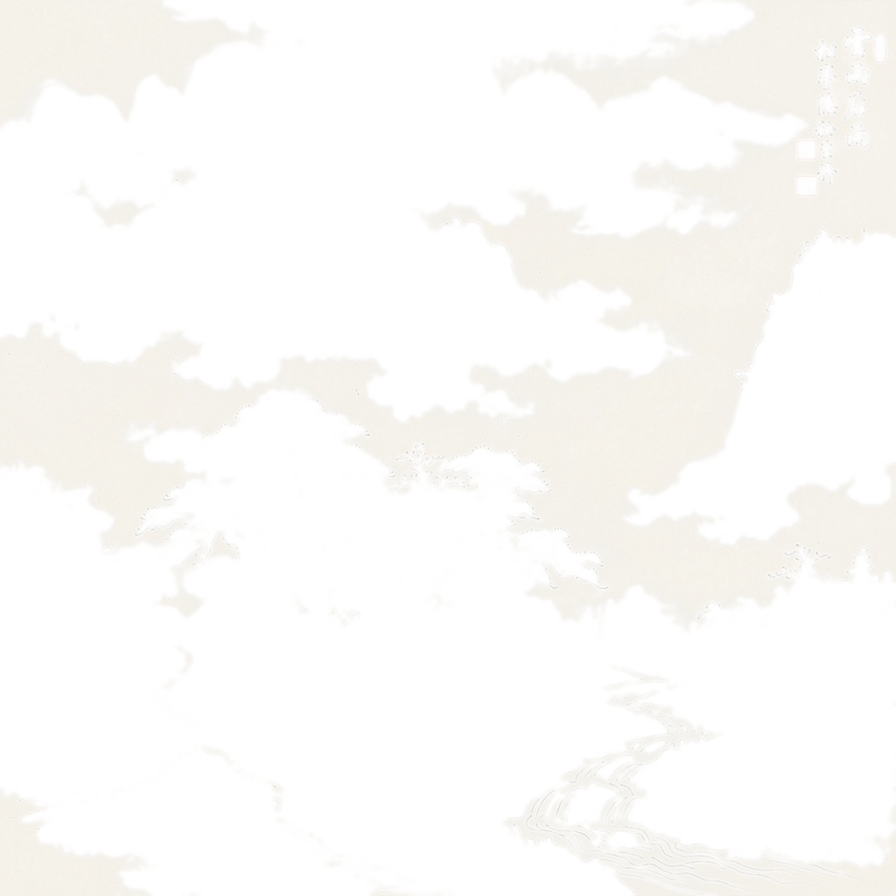
  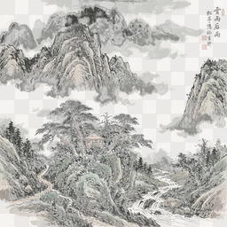
  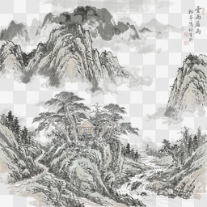
  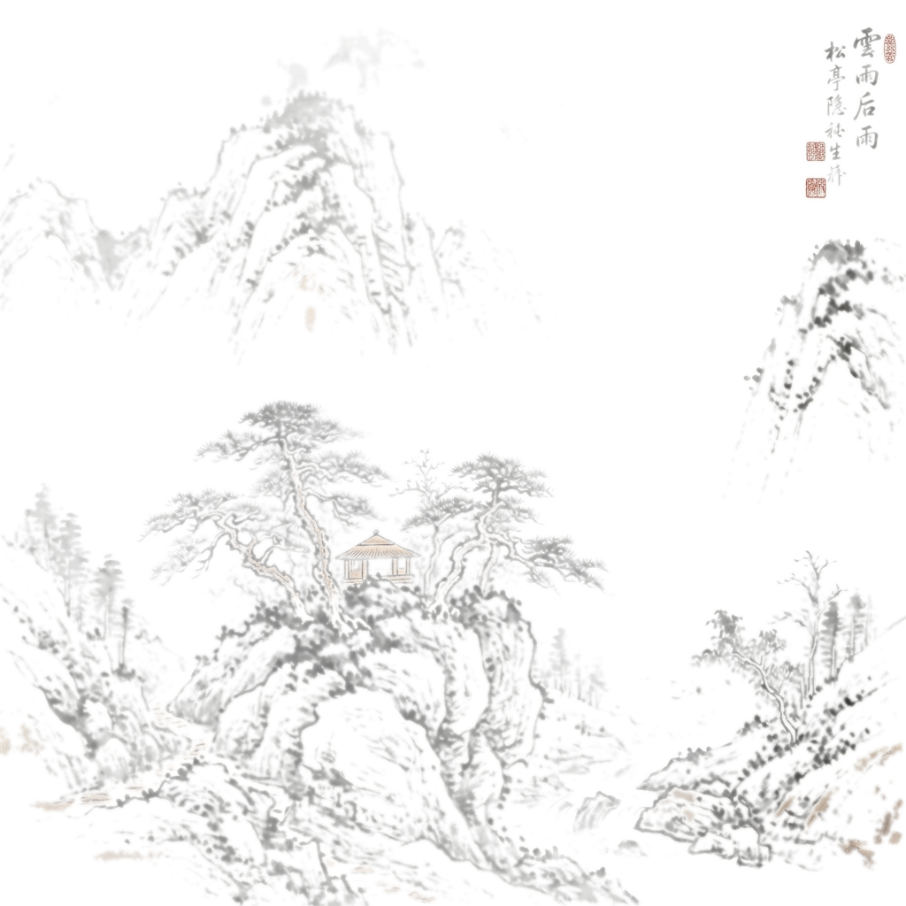
  →
  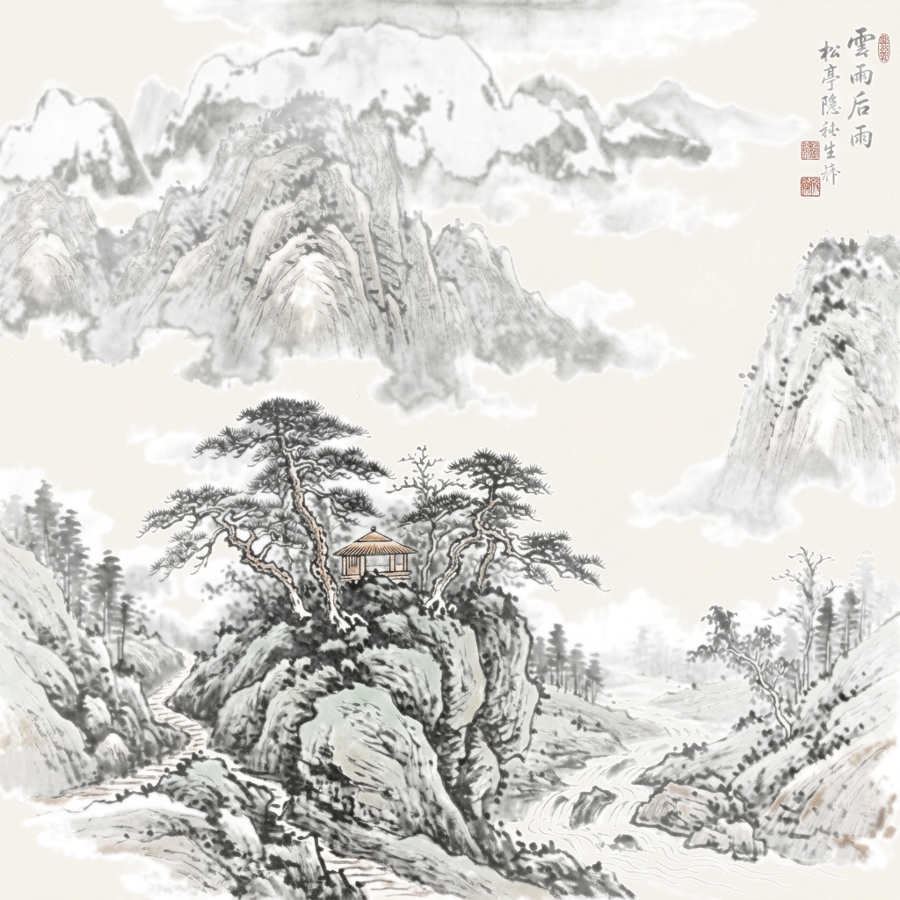
</p>
<p align="center"><em>Checkerboard = transparent areas. Calligraphy layer is only 3% opaque — just the text and seals.</em></p>

### Scenario 1: Non-Destructive Editing (Artists)

*"The sky doesn't feel right, but the mountains are perfect."*

<p align="center">
  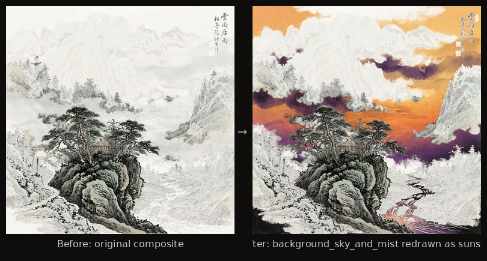
</p>

Only the sky/mist layer was redrawn — mountains, pavilion, pine trees, and calligraphy are pixel-identical.

```bash
vulca layers split artwork.png -o ./layers/ --mode regenerate --provider gemini
vulca layers lock ./layers/ --layer calligraphy_and_seals         # protect from edits
vulca layers redraw ./layers/ --layer background_sky_and_mist \
  -i "warm golden sunset with orange and purple gradients"        # redraw ONLY this layer
vulca layers composite ./layers/ -o final.png                     # other layers untouched
```

### Scenario 2: Design Asset Extraction (Designers)

*Like Figma's component extraction, but for cultural art.*

<p align="center">
  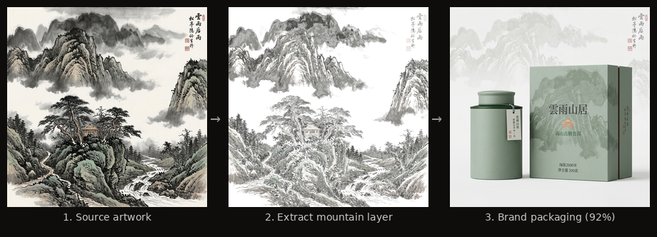
</p>

```bash
vulca layers split artwork.png -o ./layers/ --mode extract
vulca layers merge ./layers/ --layers pavilion,calligraphy --name "hero_element"
vulca layers add ./layers/ --name "golden_glow" --z-index 6 --content-type effect
vulca layers export ./layers/ -o ./design-assets.psd
# → 00_background.png, 01_mountains.png, ... + manifest.json
```

### Scenario 3: Per-Layer Cultural Evaluation (Researchers)

*Which element carries the most cultural weight?*

<p align="center">
  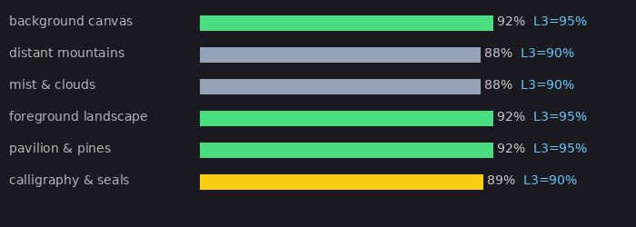
</p>

```
$ vulca layers evaluate ./layers/ -t chinese_xieyi

  [0] background_canvas:       92%  L3=95%
  [1] distant_mountains:       88%  L3=90%  ← L2=80%, room for texture variation
  [3] foreground_landscape:    92%  L3=95%
  [4] pavilion_and_pines:      92%  L2=90%  ← highest technical execution
  [5] calligraphy_and_seals:   89%  L3=90%
```

<details>
<summary>Technical reference: 3 split modes + 7 editing operations</summary>

**3 split modes** — all produce full-canvas RGBA with real transparency:

| Mode | How it works | API cost |
|------|-------------|:--------:|
| **extract** | Color-range masking from original image | Free |
| **regenerate** | Gemini redraws each layer (hybrid: Gemini content + extract alpha mask) | ~$0.05/layer |
| **sam** | SAM2 pixel-precise segmentation (`pip install vulca[sam]`) | Free (local) |

*Hybrid regenerate*: Gemini can't generate real transparency, so regenerate mode combines Gemini's high-quality content with extract's color mask for the alpha channel. Result: Gemini quality + real transparency.

**7 editing operations:**

| Operation | What it does |
|-----------|-------------|
| `add` | Create new transparent layer |
| `remove` | Delete layer (blocked if locked) |
| `reorder` | Move layer z-index |
| `toggle` | Show/hide in composite |
| `lock` | Prevent deletion/merge |
| `merge` | Combine selected layers |
| `duplicate` | Copy for experimentation |

</details>

---

## Tools — Algorithmic Analysis (No API)

5 tools that run locally with zero API cost:

<details>
<summary>See all 5 tools (GIF)</summary>
<p align="center">
  
</p>
</details>

<p align="center">
  
</p>

```
$ vulca tools run brushstroke_analyze --image artwork.png -t chinese_xieyi
  Energy: 0.87 — aligns with xieyi's expressive style. Confidence: 0.90

$ vulca tools run whitespace_analyze --image artwork.png -t chinese_xieyi
  Whitespace: 32.8% — in ideal range (30%-55%). Distribution: top_heavy.

$ vulca tools run composition_analyze --image artwork.png -t chinese_xieyi
  Thirds alignment: 0.75 — asymmetric, dynamic arrangement. Confidence: 0.90
```

Also: `color_gamut_check` (saturation profiling + fix) and `color_correct` (check/fix/suggest).

---

## Inpainting — Region-Based Repaint

Pixel-level preservation outside the bounding box — PIL local blend, not full-image regeneration.

<p align="center">
  
  →
  
</p>
<p align="center"><em>Left: original | Right: sky replaced with golden sunset (mountains untouched)</em></p>

```bash
vulca inpaint artwork.png --region "the sky in the upper portion" \
  --instruction "replace with dramatic stormy clouds" -t chinese_xieyi
vulca inpaint artwork.png --region "0,0,100,40" \
  --instruction "golden sunset gradient" --count 4 --select 1
```

---

## Studio — Brief-Driven Creative Session

<details>
<summary>See studio workflow (GIF)</summary>
<p align="center">
  
</p>
</details>

<p align="center">
  
  
  
  
</p>
<p align="center"><em>4 concepts from brief: "Cyberpunk ink wash, neon pavilions" → select → generate → 93% → accept</em></p>

```bash
vulca studio "Cyberpunk ink wash" --provider gemini               # interactive
vulca studio "Zen garden at dawn" --provider gemini --auto         # non-interactive
vulca brief ./project -i "Cyberpunk shanshui" -m "epic-futuristic"  # step by step
```

---

## Self-Evolution

The system learns from every session. After 1100+ sessions:

```
$ vulca evolution chinese_xieyi

  Dim     Original    Evolved     Change
  L1        10.0%     10.0% +    0.0%
  L2        15.0%     20.0% +    5.0%    ← Technical Execution strengthened
  L3        25.0%     35.0% +   10.0%    ← Cultural Context most evolved
  L4        20.0%     15.0%    -5.0%
  L5        30.0%     20.0%   -10.0%
  Sessions: 71
```

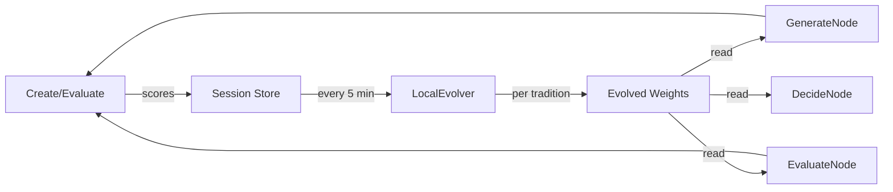

Evolution is automatic — every session contributes. `strict` mode strengthens tradition conformance, `reference` mode tracks exploration trends, `intentional_departure` deviations are not penalized.

---

## Where to Use

### Claude Code / Cursor (MCP Plugin)

```bash
pip install vulca[mcp]
claude plugin install vulca-org/vulca-plugin
```

21 MCP tools: `evaluate_artwork`, `create_artwork`, `analyze_layers`, `layers_split`, `layers_redraw`, `layers_edit`, `studio_create_brief`, `inpaint_artwork`, 5 Tool Protocol tools, and more.

### ComfyUI

```bash
git clone https://github.com/vulca-org/comfyui-vulca  # in custom_nodes/
pip install vulca>=0.9.2
```

11 nodes: Brief, Concept, Generate, Evaluate, Update, Inpaint, Layers Analyze/Composite/Export, Evolution, Traditions.

### Python SDK

```python
import vulca

result = vulca.evaluate("artwork.png", tradition="chinese_xieyi")
print(result.score, result.suggestions, result.L3)

result = vulca.create("Tea packaging", provider="gemini", tradition="brand_design")
print(result.weighted_total, result.best_image_b64[:20])

from vulca.layers import analyze_layers, split_extract, composite_layers
import asyncio
layers = asyncio.run(analyze_layers("artwork.png"))
results = split_extract("artwork.png", layers, output_dir="./layers")
composite_layers(results, width=1024, height=1024, output_path="composite.png")
```

<details>
<summary>Full CLI reference</summary>

```bash
vulca evaluate painting.jpg -t chinese_xieyi                    # strict
vulca evaluate painting.jpg -t chinese_xieyi --mode reference   # advisor
vulca evaluate painting.jpg -t xieyi,japanese --mode fusion     # cross-cultural
vulca evaluate painting.jpg --sparse-eval                       # relevant dims only

vulca create "Misty mountains" -t chinese_xieyi --provider gemini -o art.png
vulca create "Tea packaging" --provider gemini --residuals      # agent attention
vulca create "Zen garden" --provider gemini --hitl              # pause for review

vulca studio "Zen garden" --provider gemini                     # interactive
vulca studio "Zen garden" --provider gemini --auto              # non-interactive

vulca layers analyze artwork.png
vulca layers split artwork.png -o ./layers --mode extract       # or regenerate / sam
vulca layers redraw ./layers --layer sky -i "add sunset"
vulca layers add ./layers --name glow --content-type effect
vulca layers toggle ./layers --layer mist --visible false
vulca layers lock ./layers --layer background
vulca layers merge ./layers --layers fg,mid --name merged
vulca layers composite ./layers -o final.png
vulca layers export ./layers -o ./assets.psd
vulca layers evaluate ./layers -t chinese_xieyi

vulca inpaint artwork.png --region "sky" --instruction "dramatic clouds"
vulca tools run brushstroke_analyze --image art.png -t chinese_xieyi
vulca evolution chinese_xieyi
vulca sessions stats
vulca resume <session-id>
```

</details>

---

## 13 Cultural Traditions

`chinese_xieyi` `chinese_gongbi` `japanese_traditional` `western_academic` `islamic_geometric` `watercolor` `african_traditional` `south_asian` `contemporary_art` `photography` `brand_design` `ui_ux_design` + `default`

Custom traditions via YAML: `vulca evaluate painting.jpg --tradition ./my_style.yaml`

---

## Install

```bash
pip install vulca           # core SDK + CLI
pip install vulca[mcp]      # + MCP server for Claude Code / Cursor
pip install vulca[sam]      # + SAM2 pixel-precise layer extraction
```

No API key required for mock mode. For real generation + scoring: `export GOOGLE_API_KEY=your-key`

Gemini supports **512 / 1K / 2K / 4K** output with automatic size and aspect ratio mapping.

---

## Citation

```bibtex
@inproceedings{yu2025vulca,
  title={VULCA: A Framework for Culturally-Aware Visual Understanding},
  author={Yu, Haorui},
  booktitle={Findings of EMNLP 2025},
  year={2025}
}
```

## License

Apache 2.0

---

> Issues and PRs welcome. Development happens in a private monorepo and is synced here via `git subtree`.
