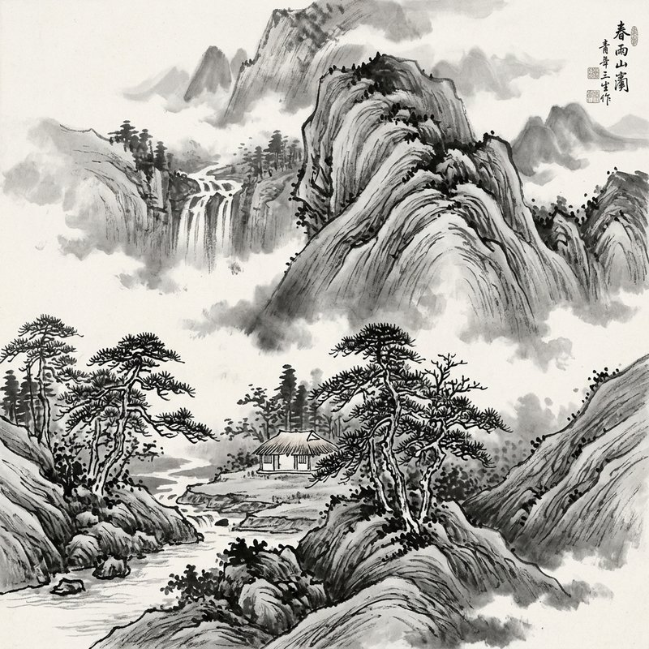
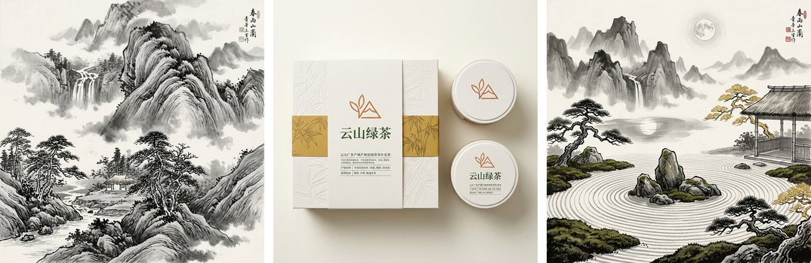
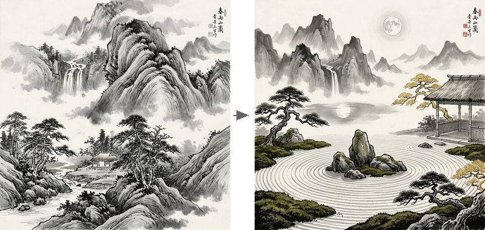
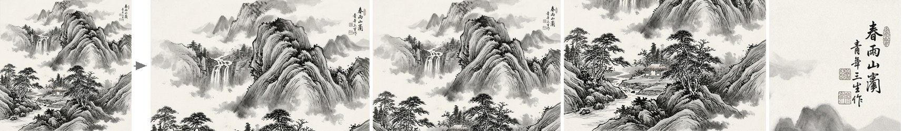
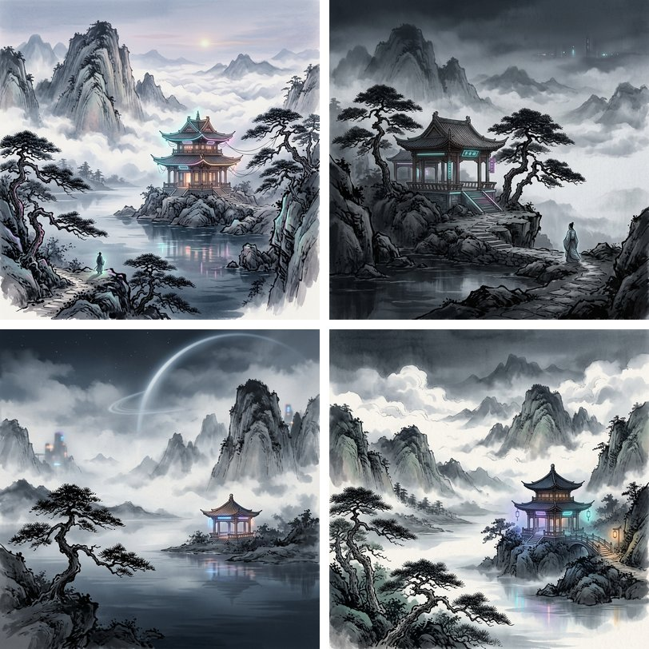

# VULCA

[](https://pypi.org/project/vulca/)
[](https://pypi.org/project/vulca/)
[](https://github.com/vulca-org/vulca/blob/main/LICENSE)
[]()

**AI-native cultural art creation organism.** Create, evaluate, and evolve artwork across 13 cultural traditions with L1-L5 scoring, self-evolving weights, and 5 algorithmic analysis tools — 21 MCP tools, all from one `pip install`.

<p align="center">
  
</p>

```bash
pip install vulca
export GOOGLE_API_KEY=your-key
vulca create "Misty mountains after rain, pine pavilion in clouds" -t chinese_xieyi -o artwork.png
# → Score: 0.915 | Tradition: chinese_xieyi | 1 round | 39s
# → Image: artwork.png
```

> Based on peer-reviewed research: [VULCA Framework](https://aclanthology.org/2025.findings-emnlp/) (EMNLP 2025 Findings) and [VULCA-Bench](https://arxiv.org/abs/2601.07986) (7,410 samples, 9 traditions).

---

## Demo

### Create — One Command, Multiple Styles

<p align="center">
  
</p>

```bash
# Chinese ink wash landscape
vulca create "Misty mountains after rain" -t chinese_xieyi

# Brand design with color injection
vulca create "Tea packaging, Eastern aesthetics" -t brand_design --colors "#C87F4A,#5F8A50,#B8923D"

# Style transfer from reference image
vulca create "Zen garden" --reference shanshui.png --ref-type style -t japanese_traditional
```

### Evaluate — Judge vs Advisor

Two modes that serve different purposes:

**Strict mode** (judge) — pass/fail with scores:
```
$ vulca evaluate artwork.png -t chinese_xieyi

  Score:     93%    Tradition: chinese_xieyi    Risk: low

    L1 Visual Perception         ██████████████████░░ 90%  ✓
    L2 Technical Execution       ██████████████████░░ 90%  ✓
    L3 Cultural Context          ███████████████████░ 95%  ✓
    L4 Critical Interpretation   ████████████████████ 100%  ✓
    L5 Philosophical Aesthetics  ██████████████████░░ 90%  ✓
```

**Reference mode** (advisor) — cultural guidance with professional terminology:
```
$ vulca evaluate artwork.png -t chinese_xieyi --mode reference

  L2 Technical Execution  85%  (traditional)
     To push further: practice more varied 'splashed ink' (泼墨) techniques
     in the distant mountains for greater expressive freedom...

  L3 Cultural Context  95%  (traditional)
     To push further: incorporate a classical poem (题画诗) to enhance
     the 'poetry-calligraphy-painting-seal' (诗书画印) integration...
```

### Fusion — Cross-Cultural Comparison

Evaluate one artwork against multiple traditions simultaneously:

```
$ vulca evaluate artwork.png -t chinese_xieyi,japanese_traditional,western_academic --mode fusion

  Dimension                   Chinese Xieyi  Japanese Trad  Western Academic
  ------------------------- --------------- -------------- ----------------
  Visual Perception                   90%            85%             40%
  Technical Execution                 85%            90%             30%
  Cultural Context                    95%            30%             10%
  Critical Interpretation             95%            95%             90%
  Philosophical Aesthetics            90%            70%             30%

  Overall Alignment                    92%            73%             44%

  Closest tradition: chinese_xieyi (92%)
```

### Style Transfer — Reference-Based Creation

<p align="center">
  
</p>

```bash
vulca create "Zen garden at moonlight" \
  --reference shanshui.png --ref-type style -t japanese_traditional
# Chinese ink style preserved → Japanese zen composition
```

### Layers — Full Editing System (V2)

<p align="center">
  
</p>

Full-canvas RGBA layers with proper blend modes (normal/screen/multiply), 3 split modes, and Photoshop-style layer editing — 13 CLI subcommands:

```bash
# Analyze & split (3 modes)
vulca layers analyze artwork.png                         # VLM semantic analysis
vulca layers split artwork.png -o ./out/                 # regenerate mode (img2img per layer)
vulca layers split artwork.png -o ./out/ --mode extract  # color-range masking (no API cost)
vulca layers split artwork.png -o ./out/ --mode sam      # SAM2 pixel-precise (pip install vulca[sam])

# Edit
vulca layers add ./out/ --name "glow" --z-index 5 --content-type effect
vulca layers remove ./out/ --layer calligraphy
vulca layers reorder ./out/ --layer foreground --z-index 0
vulca layers toggle ./out/ --layer mist --visible false
vulca layers lock ./out/ --layer background
vulca layers merge ./out/ --layers fg,mid --name merged
vulca layers duplicate ./out/ --layer background --name bg_v2

# Redraw (img2img)
vulca layers redraw ./out/ --layer foreground -i "add autumn colors"
vulca layers redraw ./out/ --layers fg,mid --merge -i "strengthen depth"

# Composite & export
vulca layers composite ./out/ -o final.png     # blend-mode-aware composite
vulca layers export ./out/ -o ./export.psd     # PNG directory + manifest
vulca layers evaluate ./out/ -t chinese_xieyi  # per-layer L1-L5 scoring
```

### Tools — Algorithmic Analysis (No API Required)

5 tools that run locally with zero API cost:

```
$ vulca tools run brushstroke_analyze --image artwork.png --tradition chinese_xieyi
  Brushstroke energy (0.96) aligns with chinese_xieyi's expressive style.
  Confidence: 0.90

$ vulca tools run whitespace_analyze --image artwork.png --tradition chinese_xieyi
  Whitespace (43.9%) is within the chinese_xieyi ideal range (30%-55%).
  The top_heavy distribution aligns well with tradition expectations.
  Confidence: 0.90

$ vulca tools run composition_analyze --image artwork.png --tradition chinese_xieyi
  Rule-of-thirds alignment (0.74), bottom_heavy asymmetry aligns with
  chinese_xieyi's preference for asymmetric, dynamic arrangements.
```

### Studio — Brief-Driven Creative Session

<p align="center">
  
</p>

```bash
# Interactive multi-round session
vulca studio "Cyberpunk ink wash, neon pavilions in misty mountains" -p gemini

# Non-interactive (scriptable, CI/CD friendly)
vulca studio "Zen garden at dawn" -p gemini --auto --max-rounds 3

# Or step by step:
vulca brief ./project -i "Cyberpunk shanshui" -m "epic-futuristic"
vulca brief-update ./project "Add more negative space, reduce neon intensity"
vulca concept ./project -n 4 -p gemini    # → 4 concept variations
vulca concept ./project --select 1         # pick the best
```

```
Studio session: R1 → 92% → NL update → R2 → 98% → Accept
Score progression shows iterative improvement through human-AI collaboration.
```

---

## Where to Use

### Claude Code / Cursor (MCP Plugin)

```bash
pip install vulca[mcp]
claude plugin install vulca-org/vulca-plugin
```

Then just ask: *"Evaluate this painting for Chinese xieyi style"* — Claude calls VULCA automatically.

21 MCP tools available: `evaluate_artwork`, `create_artwork`, `studio_create_brief`, `analyze_layers`, `layers_split`, `layers_redraw`, `layers_edit` (7 operations), and more. Plus 5 Tool Protocol tools (`tool_brushstroke_analyze`, `tool_whitespace_analyze`, etc.).

### ComfyUI

```bash
# In ComfyUI/custom_nodes/
git clone https://github.com/vulca-org/comfyui-vulca
pip install vulca>=0.9.1
```

11 nodes: Brief, Concept, Generate, Evaluate, Update, Inpaint, Layers Analyze/Composite/Export, Evolution, Traditions.

### CLI

```bash
pip install vulca

vulca evaluate painting.jpg -t chinese_xieyi
vulca evaluate painting.jpg -t chinese_xieyi --sparse-eval  # only relevant dimensions
vulca create "Misty mountains in ink wash" -p gemini -o artwork.png
vulca create "Tea packaging" -p gemini --residuals           # show agent attention weights
vulca studio "Zen garden" -p gemini                          # interactive session
vulca studio "Zen garden" -p gemini --auto                   # non-interactive
vulca layers split artwork.png -o ./layers                   # 3 modes: regenerate/extract/sam
vulca layers redraw ./layers --layer sky -i "add sunset"     # img2img per layer
vulca layers add ./layers --name glow --content-type effect  # 7 editing operations
vulca inpaint artwork.png --region "sky" --instruction "add clouds"
vulca evolution chinese_xieyi                                # see evolved weights + session count
vulca sessions stats                                         # analyze 1100+ local sessions
vulca resume <session-id>                                    # resume from checkpoint
```

### Python SDK

```python
import vulca

# Evaluate
result = vulca.evaluate("artwork.png", tradition="chinese_xieyi")
print(result.score, result.dimensions, result.suggestions)

# Create
result = vulca.create("Tea packaging with mountain landscape", provider="mock")
print(result.best_image_b64[:50], result.weighted_total)

# Studio (Brief-driven multi-round)
session = vulca.StudioSession.from_intent("Zen garden at dawn")
session.generate_concepts()
session.select(0)
session.accept()
```

## Features

### Evaluation (L1-L5)

5-dimension cultural scoring based on peer-reviewed research:

| Dimension | What it measures |
|-----------|-----------------|
| **L1** Visual Perception | Composition, color harmony, spatial arrangement |
| **L2** Technical Execution | Rendering quality, technique fidelity, craftsmanship |
| **L3** Cultural Context | Tradition-specific motifs, canonical conventions |
| **L4** Critical Interpretation | Cultural sensitivity, contextual framing |
| **L5** Philosophical Aesthetics | Artistic depth, emotional resonance, spiritual qualities |

Each dimension returns: score (0-1), observations, rationale, actionable suggestion, reference technique, deviation type.

### Three Evaluation Modes

- **strict** (default): Judge — scores reflect tradition conformance
- **reference**: Advisor — shows cultural alignment without judgment
- **fusion**: Compare against multiple traditions simultaneously

### Creation Pipeline

```
Generate → Evaluate → Decide → (loop if below threshold)
```

Multi-round with automatic improvement: each round targets the weakest dimensions from the previous evaluation. HITL (Human-in-the-Loop) pause supported with checkpoint save. Use `--output` to save generated images to disk.

### Studio (Brief-Driven)

```
Intent → Brief → Concepts → Select → Generate → Evaluate → Refine
```

Natural language throughout: *"Make the teapot larger"*, *"Add more warmth to the color palette"*.

### Layers (V2)

Industry-aligned layer editing: every layer is full-canvas RGBA (not bbox crops). 3 split modes (regenerate/extract/SAM), proper blend modes (normal/screen/multiply), 7 editing operations (add/remove/reorder/toggle/lock/merge/duplicate), single-layer and multi-layer redraw via img2img.

### Inpainting

Region-based repaint with pixel-level guarantee: pixels outside the bounding box are 100% preserved (PIL local blend, not full-image regeneration).

### Tool Protocol (v0.9.1)

5 algorithmic analysis tools that run without API calls:

| Tool | What it does |
|------|-------------|
| `whitespace_analyze` | Detect negative space patterns |
| `composition_analyze` | Rule of thirds, center weight, balance |
| `color_gamut_check` | Saturation profiling + fix mode |
| `brushstroke_analyze` | Sobel gradient direction detection |
| `color_correct` | Color correction with check/fix/suggest |

Hybrid pipeline: algorithmic tools run first, VLM evaluation covers remaining dimensions.

### Self-Evolution (Closed Loop)

The system learns from every session:

1. Pipeline scores feed into `LocalEvolver` → evolved weights
2. **GenerateNode** reads evolved weights → strengthens historically weak dimensions
3. **EvaluateNode** reads evolved weights → calibrated scoring
4. **DecideNode** reads evolved threshold → adaptive accept/rerun decisions
5. `eval_mode` aware: strict sessions strengthen tradition; reference sessions track exploration trends
6. `deviation_type` filtering: intentional departures are not treated as weaknesses

### Pipeline Checkpoint

Every round auto-saved to `~/.vulca/data/checkpoints/` — including HITL paused sessions with generated images. Resume from any round:

```bash
vulca resume <session-id> --from-round 2
```

## 13 Cultural Traditions

`chinese_xieyi` `chinese_gongbi` `japanese_traditional` `western_academic` `islamic_geometric` `watercolor` `african_traditional` `south_asian` `contemporary_art` `photography` `brand_design` `ui_ux_design` + `default`

Custom traditions via YAML:

```bash
vulca tradition --init my_style.yaml   # generate template
vulca evaluate painting.jpg --tradition ./my_style.yaml
```

## Install

```bash
pip install vulca           # core SDK + CLI
pip install vulca[mcp]      # + MCP server for Claude Code / Cursor
pip install vulca[sam]      # + SAM2 pixel-precise layer extraction
```

No API key required for mock mode. For real VLM scoring + image generation:

```bash
export GOOGLE_API_KEY=your-key
```

Gemini image generation supports **512/1K/2K/4K** output with automatic size mapping — pass any width/height and VULCA selects the optimal `imageSize` tier and `aspectRatio`.

## Citation

```bibtex
@inproceedings{yu2025vulca,
  title={VULCA: A Framework for Culturally-Aware Visual Understanding},
  author={Yu, Haorui},
  booktitle={Findings of EMNLP 2025},
  year={2025}
}
```

## License

Apache 2.0

---

> **Source of truth**: This repository is synced from the [VULCA monorepo](https://github.com/yha9806/website) via `git subtree`. Development happens in the monorepo; this repo is the public distribution mirror. Issues and PRs are welcome here.
