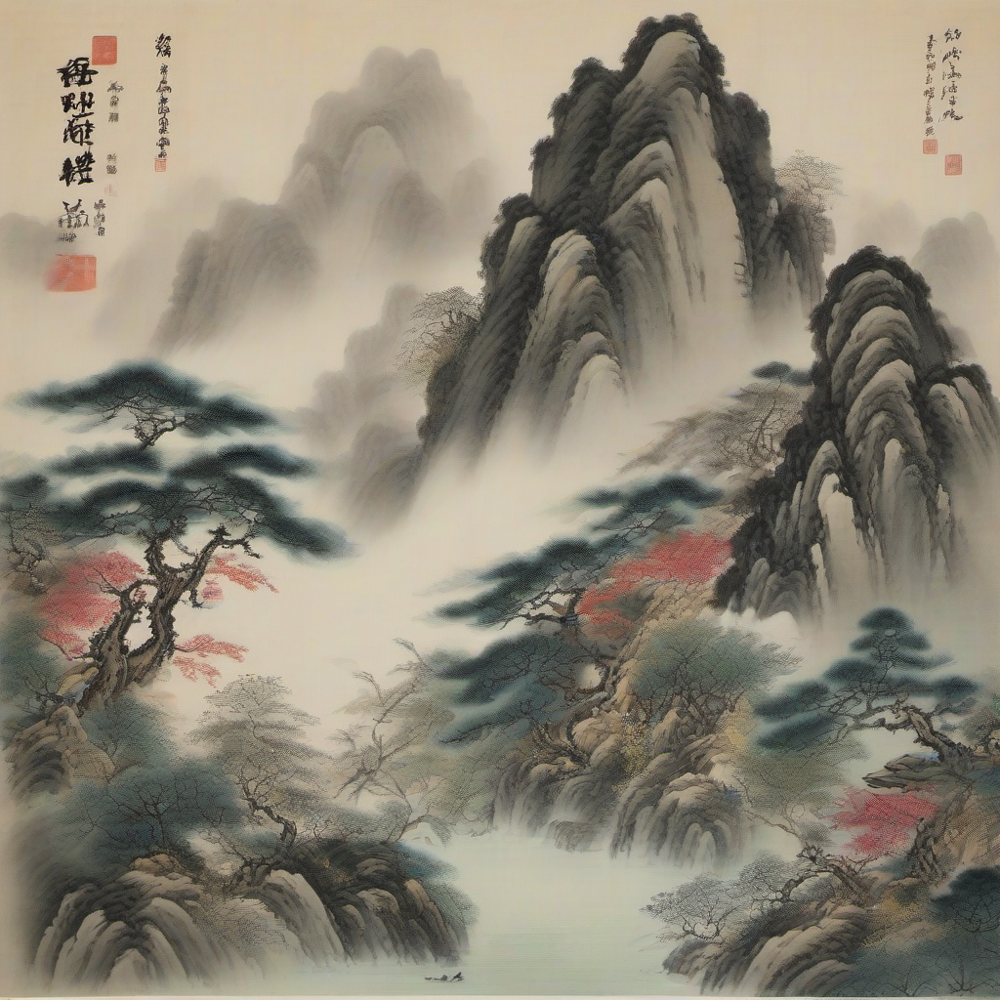
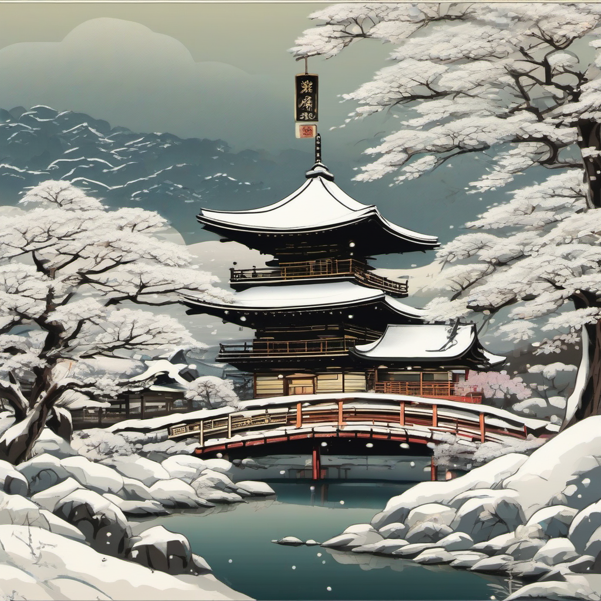
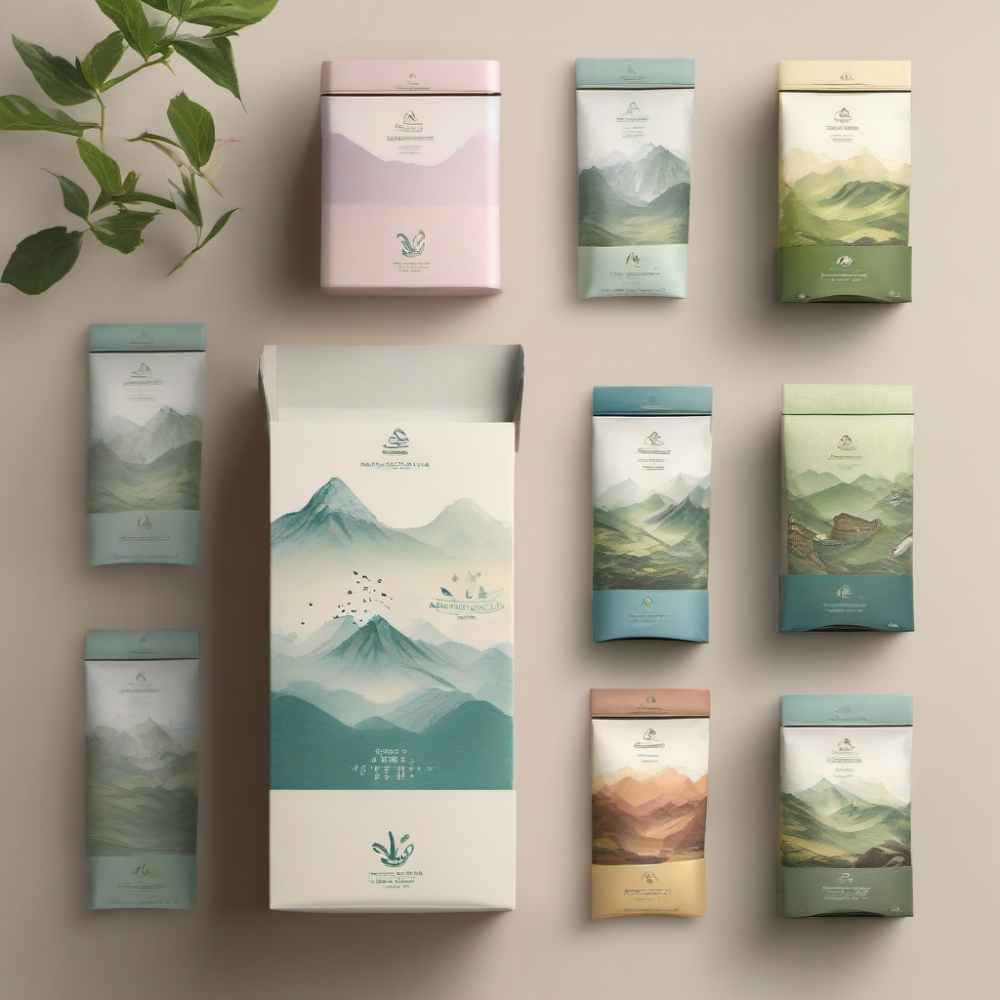
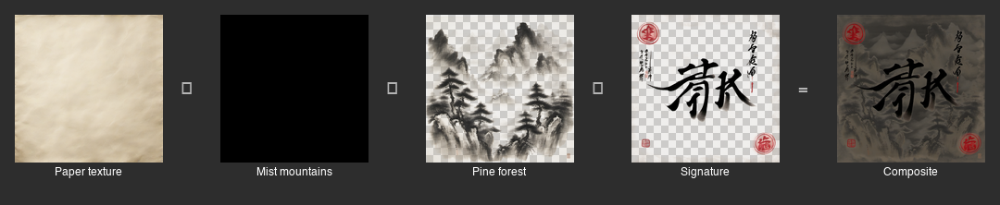
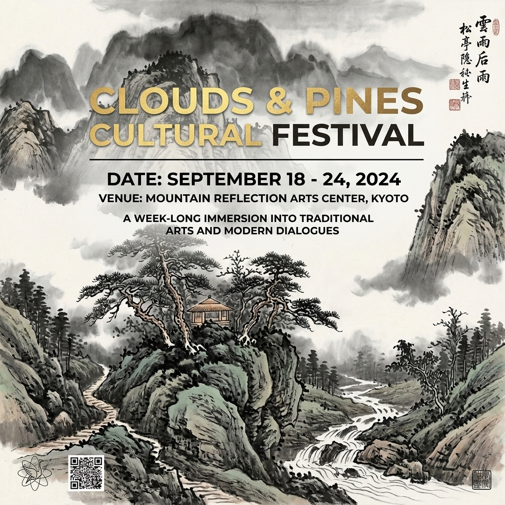
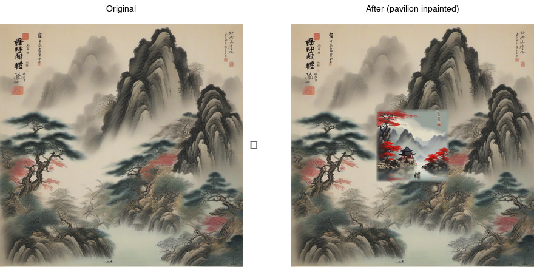
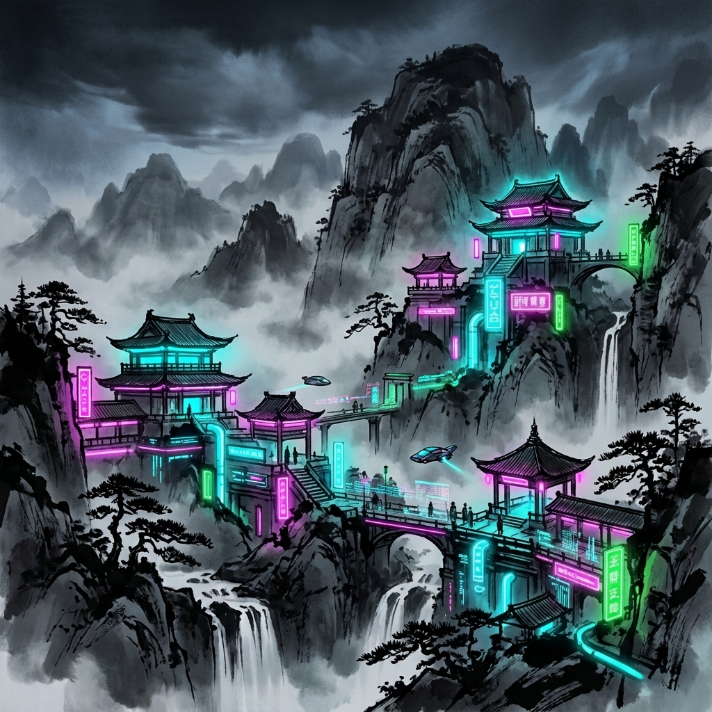
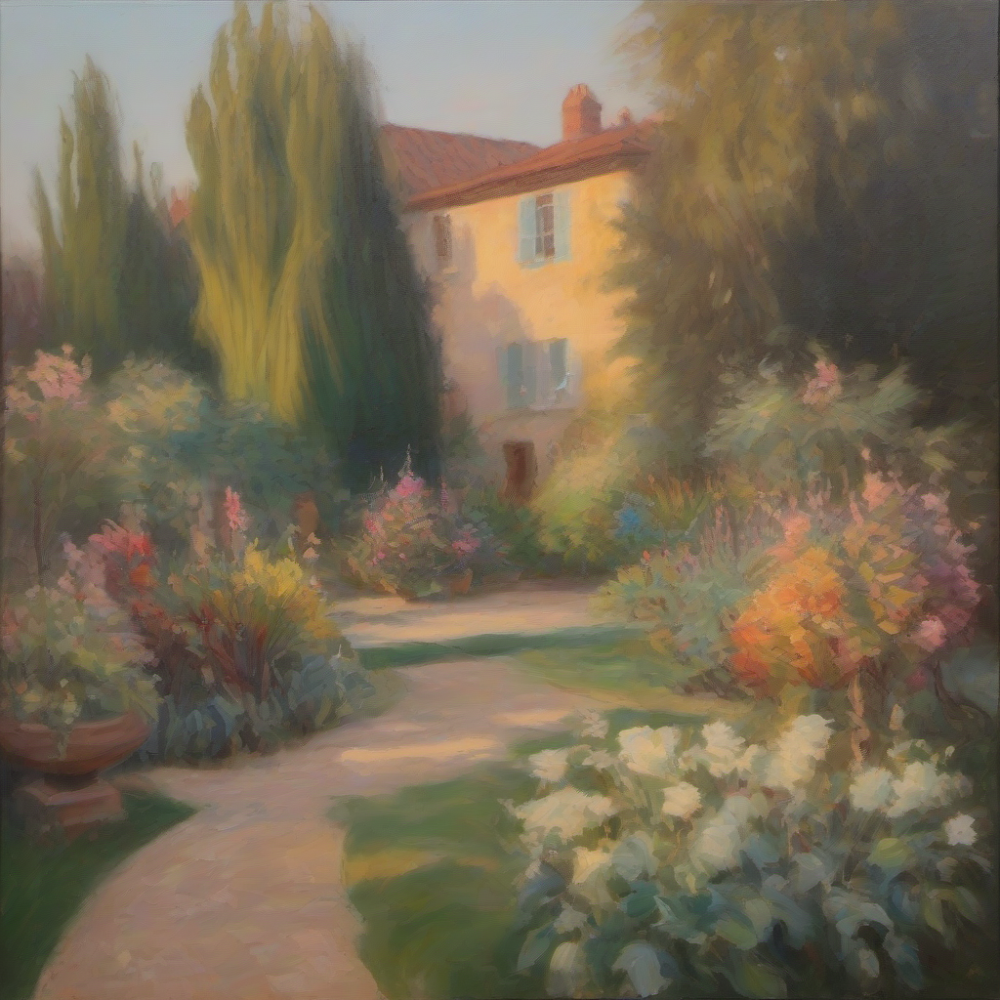
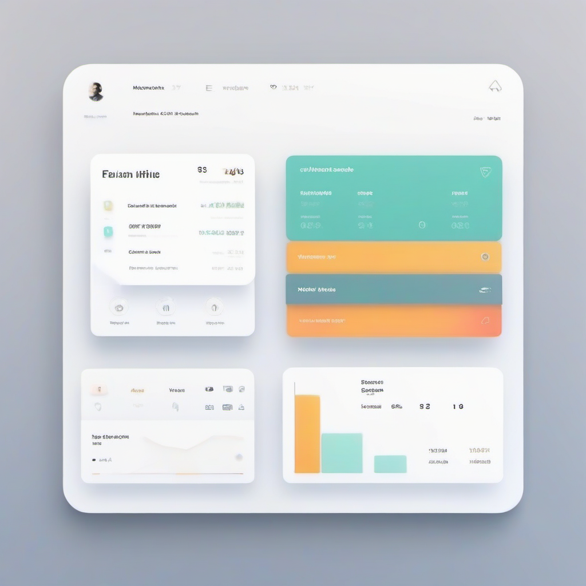
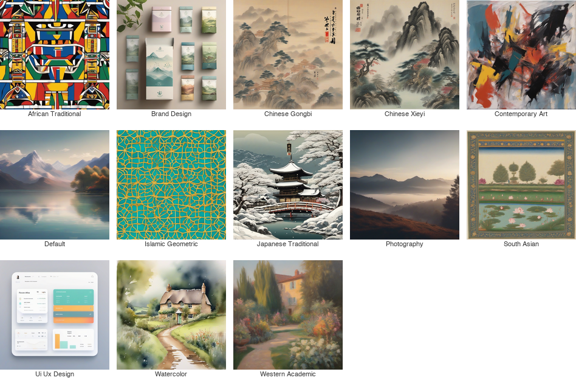

# VULCA

[](https://pypi.org/project/vulca/)
[](https://pypi.org/project/vulca/)
[](https://github.com/vulca-org/vulca/blob/main/LICENSE)
[](https://github.com/vulca-org/vulca-plugin)

**AI-native cultural art creation SDK. Generate, evaluate, decompose, and evolve visual art across 13 cultural traditions — runs locally (ComfyUI + Ollama) or in the cloud (Gemini). L1-L5 scoring, structured layer generation, self-evolving weights.**

<p align="center">
  
  
  
</p>
<p align="center"><em>Three traditions, one SDK — generated locally via ComfyUI/SDXL, zero cloud API cost</em></p>

```
$ vulca evaluate mona_lisa.jpg -t western_academic

  Score:     100%   Tradition: western_academic   Risk: low

    L1 Visual Perception         ████████████████████ 100%  ✓
    L2 Technical Execution       ████████████████████ 100%  ✓
    L3 Cultural Context          ████████████████████ 100%  ✓
    L4 Critical Interpretation   ████████████████████ 100%  ✓
    L5 Philosophical Aesthetics  ████████████████████ 100%  ✓
```

> Based on peer-reviewed research: [VULCA Framework](https://aclanthology.org/2025.findings-emnlp/) (EMNLP 2025 Findings) and [VULCA-Bench](https://arxiv.org/abs/2601.07986) (7,410 samples, L1-L5 definitions).

---

## Install

```bash
pip install vulca
```

### Local stack (free, no API key)

Set up [ComfyUI](https://github.com/comfyanonymous/ComfyUI) + [Ollama](https://ollama.ai) for zero-cost local generation:

```bash
export VULCA_IMAGE_BASE_URL=http://localhost:8188   # ComfyUI
export VULCA_VLM_MODEL=ollama_chat/gemma4            # Ollama VLM
vulca create "Misty mountains after spring rain" -t chinese_xieyi --provider comfyui -o art.png
```

> See [Local Provider Setup](docs/local-provider-setup.md) for full ComfyUI + Ollama installation guide.

### Cloud (Gemini)

```bash
export GOOGLE_API_KEY=your-key
vulca create "Misty mountains" -t chinese_xieyi -o art.png
```

### No GPU? Try mock mode

```bash
vulca create "Misty mountains" -t chinese_xieyi --provider mock -o art.png
```

<details>
<summary>Optional extras</summary>

```bash
pip install vulca[mcp]             # MCP server for Claude Code / Cursor
pip install vulca[layers-full]     # rembg + SAM2 for layer extraction
pip install vulca[tools]           # OpenCV algorithmic analysis tools
pip install vulca[all]             # everything
```

</details>

---

## What You Can Do

### [Generate](#create) — 13 cultural traditions, structured layers
```bash
vulca create "水墨山水" -t chinese_xieyi --layered --provider comfyui
```

### [Evaluate](#evaluate--three-modes) — L1-L5 cultural scoring, three modes
```bash
vulca evaluate artwork.png -t chinese_xieyi --mode reference
```

### [Edit](#edit--inpaint) — layer redraw + region inpaint
```bash
vulca layers redraw ./layers/ --layer sky -i "warm golden sunset"
vulca inpaint art.png --region "the sky" --instruction "stormy clouds"
```

### [Decompose](#decompose) — split any image into transparent layers
```bash
vulca layers split painting.jpg -o ./layers/ --mode extract
```

### [Studio](#studio--brief-driven-creative-session) — brief-driven creative sessions
```bash
vulca studio "Cyberpunk ink wash" --provider comfyui --auto
```

### [Analyze](#tools--algorithmic-analysis-no-api) — 5 algorithmic tools, zero API cost
```bash
vulca tools run brushstroke_analyze --image art.png -t chinese_xieyi
```

---

## Create

<details>
<summary>See create + evaluate workflow (GIF, 3.8 MB)</summary>
<p align="center">
  <!-- v2-asset -->
  
</p>
</details>

```bash
vulca create "水墨山水，雨后春山" -t chinese_xieyi --provider comfyui -o landscape.png
vulca create "Tea packaging, Eastern aesthetics" -t brand_design --provider gemini --colors "#C87F4A,#5F8A50"
vulca create "Zen garden at dawn" -t japanese_traditional --provider comfyui --hitl
```

> **CJK-aware prompts:** VULCA automatically translates CJK prompts to English for CLIP-based providers (ComfyUI/SDXL) while preserving CJK natively for multilingual providers (Gemini).

### Structured Creation (`--layered`)

VULCA plans the layer structure from tradition knowledge. The first layer generates serially as a style anchor — its raw RGB output becomes the visual reference for all subsequent layers, which generate in parallel (Defense 3, v0.14).

```bash
vulca create "水墨山水，松间茅屋" -t chinese_xieyi --layered --provider comfyui
# → 5 layers: paper, distant_mountains, mountains_pines, hut_figure, calligraphy
```

Works across traditions — photography produces depth layers, gongbi produces line art + wash layers, brand design produces logo + background + typography layers.

<p align="center"></p>

### Layer-Driven Design Transfer

Extract elements from one artwork, transform into a new design while preserving cultural context:

<p align="center">
  <!-- v2-asset -->
  
  →
  <!-- v2-asset -->
  
  →
  <!-- v2-asset -->
  
</p>
<p align="center"><em>Ink wash painting → extract mountain layer → tea packaging (92% brand consistency)</em></p>

```bash
vulca layers split landscape.png -o ./layers/ --mode extract
vulca create "Premium tea packaging, mountain watermark" \
  -t brand_design --reference ./layers/distant_mountains.png --provider comfyui
```

---

## Evaluate — Three Modes

| Dimension | What It Measures |
|-----------|-----------------|
| **L1** Visual Perception | Composition, color harmony, spatial arrangement |
| **L2** Technical Execution | Rendering quality, technique fidelity, craftsmanship |
| **L3** Cultural Context | Tradition-specific motifs, canonical conventions |
| **L4** Critical Interpretation | Cultural sensitivity, contextual framing |
| **L5** Philosophical Aesthetics | Artistic depth, emotional resonance, spiritual qualities |

### Strict Mode (Judge)

Binary cultural scoring — does the art conform to the tradition?

```
$ vulca evaluate artwork.png -t chinese_xieyi

  Score:     90%    Tradition: chinese_xieyi    Risk: low

    L1 Visual Perception         ██████████████████░░ 90%  ✓
    L2 Technical Execution       █████████████████░░░ 85%  ✓
    L3 Cultural Context          ██████████████████░░ 90%  ✓
    L4 Critical Interpretation   ████████████████████ 100%  ✓
    L5 Philosophical Aesthetics  ██████████████████░░ 90%  ✓
```

### Reference Mode (Mentor)

Cultural guidance with professional terminology — not a judge, a mentor:

```
$ vulca evaluate artwork.png -t chinese_xieyi --mode reference

  L1 Visual Perception         ██████████████████░░ 90%  (traditional)
     To push further: varying the density of the mist (留白) more dramatically,
     using a darker, more diffused wash to suggest deeper valleys.

  L2 Technical Execution       █████████████████░░░ 85%  (traditional)
     To push further: exploring texture strokes — axe-cut (斧劈皴)
     for sharper rocks, rain-drop (雨点皴) for rounded forms.

  L3 Cultural Context          ███████████████████░ 95%  (traditional)
     To push further: adding a poem (题画诗) for poetry-calligraphy-
     painting-seal (诗书画印) harmony.
```

### Fusion Mode (Cross-Cultural Comparison)

Evaluate the same artwork against multiple traditions simultaneously:

```
$ vulca evaluate artwork.png -t chinese_xieyi,japanese_traditional,western_academic --mode fusion

  Dimension                   Chinese Xieyi Japanese Tradit Western Academi
  Visual Perception                   90%             90%             10%
  Technical Execution                 90%             90%             10%
  Cultural Context                    95%             80%              0%
  Critical Interpretation            100%            100%             10%
  Philosophical Aesthetics            90%             90%             10%
  Overall Alignment                    93%             90%              8%

  Closest tradition: chinese_xieyi (93%)
```

---

## Edit + Inpaint

### Layer-Based Editing

*"The sky doesn't feel right, but the mountains are perfect."*

<p align="center">
  <!-- v2-asset -->
  
</p>

Only the sky layer was redrawn — mountains, pavilion, pine trees, and calligraphy are pixel-identical. Now provider-agnostic (v0.15) — works with ComfyUI, Gemini, or any provider.

```bash
vulca layers split artwork.png -o ./layers/ --mode regenerate --provider comfyui
vulca layers lock ./layers/ --layer calligraphy_and_seals
vulca layers redraw ./layers/ --layer background_sky \
  -i "warm golden sunset with orange and purple gradients"
vulca layers composite ./layers/ -o final.png
```

<details>
<summary>Scenario 2: Event Poster Design (Designers)</summary>

<p align="center">
  <!-- v2-asset -->
  
  →
  <!-- v2-asset -->
  
</p>
<p align="center"><em>Ink wash painting → event poster with typography (92% brand consistency)</em></p>

```bash
vulca layers split artwork.png -o ./layers/ --mode extract
vulca layers merge ./layers/ --layers mountains,pavilion,mist --name "poster_bg"
vulca create "Cultural festival poster, modern typography overlay" \
  -t brand_design --reference ./layers/poster_bg.png
```

</details>

<details>
<summary>7 layer editing operations</summary>

| Operation | What It Does |
|-----------|-------------|
| `add` | Create new transparent layer |
| `remove` | Delete layer (blocked if locked) |
| `reorder` | Move layer z-index |
| `toggle` | Show/hide in composite |
| `lock` | Prevent deletion/merge |
| `merge` | Combine selected layers |
| `duplicate` | Copy for experimentation |

</details>

### Region-Based Inpainting

Pixel-level preservation outside the target region. PIL local blend, not full-image regeneration. Provider parameter added in v0.15 — no longer Gemini-only.

<p align="center"></p>

```bash
vulca inpaint artwork.png --region "the sky in the upper portion" \
  --instruction "replace with dramatic stormy clouds" -t chinese_xieyi --provider comfyui
vulca inpaint artwork.png --region "0,0,100,40" \
  --instruction "golden sunset gradient" --count 4 --select 1 --provider gemini
```

---

## Decompose

Split any image into semantically meaningful layers with real transparency.

<details>
<summary>See layer decomposition in action (GIF, 3.3 MB)</summary>
<p align="center">
  <!-- v2-asset -->
  
</p>
</details>

<!-- v2-asset -->
<p align="center">
  
  →
  
  
  
</p>
<p align="center"><em>Qi Baishi's Shrimp → shrimp / calligraphy / seals — each on transparent canvas</em></p>

<!-- v2-asset -->
<p align="center">
  
  →
  
  
</p>
<p align="center"><em>Mona Lisa → face & hair / body & dress — clean semantic separation</em></p>

```bash
vulca layers split qi_baishi.jpg -o ./layers/ --mode regenerate --provider comfyui
vulca layers split mona_lisa.jpg -o ./layers/ --mode extract    # free, no API
vulca layers split photo.jpg -o ./layers/ --mode sam            # SAM2 segmentation
```

Three split modes — all produce full-canvas RGBA with real transparency:

| Mode | How It Works | Cost |
|------|-------------|:----:|
| **extract** | Color-range masking from original pixels | Free |
| **regenerate** | Redraws each layer (content + alpha mask) | ~$0.05/layer |
| **sam** | SAM2 pixel-precise segmentation | Free (local) |

---

## Studio — Brief-Driven Creative Session

<details>
<summary>See studio workflow (GIF, 1.6 MB)</summary>
<p align="center">
  <!-- v2-asset -->
  
</p>
</details>

<!-- v2-asset -->
<p align="center">
  
  
  
  
  →
  
</p>
<p align="center"><em>Brief: "Cyberpunk ink wash, neon pavilions" → 4 concepts → select #2 → final output (93%)</em></p>

```bash
vulca studio "Cyberpunk ink wash" --provider comfyui              # interactive (local)
vulca studio "Zen garden at dawn" --provider gemini --auto        # non-interactive (cloud)
vulca brief ./project -i "Cyberpunk shanshui" -m "epic-futuristic"  # step by step
```

---

## Tools — Algorithmic Analysis (No API)

5 tools that run locally with zero API cost. Feed results into VLM evaluation for hybrid scoring.

<details>
<summary>See all 5 tools in action (GIF, 1.4 MB)</summary>
<p align="center">
  <!-- v2-asset -->
  
</p>
</details>

<!-- v2-asset -->
<p align="center">
  
</p>

```
$ vulca tools run brushstroke_analyze --image artwork.png -t chinese_xieyi
  Energy: 0.87 — aligns with xieyi's expressive style. Confidence: 0.90

$ vulca tools run whitespace_analyze --image artwork.png -t chinese_xieyi
  Whitespace: 32.8% — in ideal range (30%-55%). Distribution: top_heavy.

$ vulca tools run composition_analyze --image artwork.png -t chinese_xieyi
  Thirds alignment: 0.75 — asymmetric, dynamic arrangement. Confidence: 0.90

$ vulca tools run color_gamut_check --image artwork.png -t chinese_xieyi
  In-gamut: 98.2% — 1.8% pixels over-saturated. Fix mode: auto-desaturate.

$ vulca tools run color_correct --image artwork.png -t chinese_xieyi
  Suggestion: reduce saturation 5% for ink wash feel. Channel bias: R+2, G+1, B-3.
```

---

## Architecture

```
┌──────────────────────────────────────────────────────────────┐
│                         User Intent                          │
└──────┬───────────┬──────────────┬──────────────┬─────────────┘
       │           │              │              │
  ┌────▼──┐  ┌─────▼───┐  ┌──────▼─────┐  ┌─────▼─────┐
  │  CLI  │  │  Python  │  │    MCP     │  │  ComfyUI  │
  │       │  │   SDK    │  │  21 tools  │  │  11 nodes │
  └───┬───┘  └────┬────┘  └──────┬─────┘  └─────┬─────┘
      └───────────┴───────┬──────┴───────────────┘
                          │
                 vulca.pipeline.execute()
                          │
      ┌───────────────────┼───────────────────┐
      │                   │                   │
 ┌────▼────┐       ┌──────▼─────┐      ┌──────▼──────┐
 │ DEFAULT │       │  LAYERED   │      │  CULTURAL   │
 │ Gen→Eval│       │ Plan→Layer │      │  Tools+VLM  │
 │ →Decide │       │ →Artifact  │      │  Hybrid     │
 └────┬────┘       └──────┬─────┘      └──────┬──────┘
      └───────────────────┼───────────────────┘
                          │
              ┌───────────▼───────────┐
              │    Image Providers    │
              │  ComfyUI │ Gemini    │
              │  OpenAI  │ Mock      │
              └───────────┬───────────┘
                          │
              ┌───────────▼───────────┐
              │    VLM Evaluation     │
              │  Ollama + Gemma 4    │
              │  (or cloud Gemini)   │
              └───────────┬───────────┘
                          │
              ┌───────────▼───────────┐
              │    13 Traditions      │
              │  Weights + Taboos +   │
              │  Terminology + L1-L5  │
              └───────────────────────┘
```

**4 image providers:** ComfyUI (local SDXL), Mock (no GPU), Gemini (cloud), OpenAI (cloud).

| Provider | Generate | Inpaint | Layered | Multilingual |
|----------|----------|---------|---------|-------------|
| ComfyUI  | ✓        | ✓       | ✓       | English-only |
| Gemini   | ✓        | ✓       | ✓       | CJK native   |
| OpenAI   | ✓        | —       | —       | English-only |
| Mock     | ✓        | ✓       | ✓       | —            |

All 8 E2E phases validated on local stack (ComfyUI + Ollama, Apple Silicon MPS). See [MPS Compatibility Guide](docs/apple-silicon-mps-comfyui-guide.md).

<details>
<summary>Self-Evolution</summary>

The system learns from every session. Evolved weights, few-shot references, and cultural insights feed back into evaluation and generation prompts automatically.

```
$ vulca evolution chinese_xieyi

  Dim     Original    Evolved     Change
  L1        10.0%     10.0% +    0.0%
  L2        15.0%     20.0% +    5.0%    ← Technical Execution strengthened
  L3        25.0%     35.0% +   10.0%    ← Cultural Context most evolved
  L4        20.0%     15.0%    -5.0%
  L5        30.0%     20.0%   -10.0%
  Sessions: 71
```

```
Create / Evaluate ──► Session Store ──► LocalEvolver (per tradition)
       ▲                                        │
       └──────── Evolved Weights ◄──────────────┘
```

Evolution is automatic — every session contributes. `strict` mode strengthens tradition conformance, `reference` mode tracks exploration trends. Intentional departures are not penalized. Gating: minimum 5 sessions + 3 feedback sessions before weights shift.

</details>

---

## 13 Cultural Traditions

<p align="center">
  
  
  
  
  
</p>
<p align="center"><em>Cultural traditions / Design disciplines / Media types — each with its own L1-L5 weights, terminology, and taboos</em></p>

<details>
<summary>All 13 traditions</summary>
<p align="center">
  
</p>
</details>

`chinese_xieyi` `chinese_gongbi` `japanese_traditional` `western_academic` `islamic_geometric` `watercolor` `african_traditional` `south_asian` `contemporary_art` `photography` `brand_design` `ui_ux_design` `default`

Custom traditions via YAML — `vulca evaluate painting.jpg --tradition ./my_style.yaml`:

```yaml
# my_style.yaml
name: pixel_art
display_name: { en: Pixel Art, zh: 像素艺术 }
weights: { L1: 0.25, L2: 0.30, L3: 0.15, L4: 0.15, L5: 0.15 }
terminology:
  - term: sprite
    definition: A small raster graphic used as a visual unit
    l_levels: [L1, L2]
taboos:
  - rule: Do not apply anti-aliasing judgments
    severity: high
```

---

## Entry Points, Research + Citation

### CLI

```bash
vulca create "intent" -t tradition --provider comfyui -o art.png
vulca create "intent" -t tradition --layered                  # structured layers
vulca evaluate art.png -t tradition --mode reference           # mentor mode
vulca layers split art.png -o ./layers/ --mode regenerate      # decompose
vulca layers redraw ./layers/ --layer sky -i "add sunset"      # edit
vulca layers composite ./layers/ -o final.png                  # composite
vulca inpaint art.png --region "sky" --instruction "storm"     # inpaint
vulca studio "concept" --provider comfyui --auto               # brief session
vulca tools run brushstroke_analyze --image art.png            # algorithmic
vulca evolution tradition_name                                 # check evolution
```

<details>
<summary>Full CLI reference (all commands + flags)</summary>

```bash
# Create
vulca create "intent" -t tradition --provider mock|gemini|openai|comfyui
  --layered                    # structured layer generation
  --hitl                       # pause for human review
  --weights "L1=0.3,L2=0.2"   # custom dimension weights
  --reference ref.png          # reference image
  --colors "#hex1,#hex2"       # color palette constraint
  --residuals                  # attention residuals
  --sparse-eval                # evaluate only relevant dimensions
  -o output.png                # output path

# Evaluate
vulca evaluate image.png -t tradition
  --mode strict|reference|fusion
  --skills brand,audience,trend  # extra commercial scoring skills
  --sparse-eval                # auto-select relevant dimensions

# Layers (14 subcommands)
vulca layers analyze image.png
vulca layers split image.png -o dir --mode extract|regenerate|sam
vulca layers redraw dir --layer name -i "instruction"
vulca layers add dir --name name --content-type type
vulca layers toggle dir --layer name --visible true|false
vulca layers lock dir --layer name
vulca layers merge dir --layers a,b --name merged
vulca layers duplicate dir --layer name
vulca layers composite dir -o output.png
vulca layers export dir -o output.psd
vulca layers evaluate dir -t tradition
vulca layers regenerate dir --provider gemini

# Inpainting
vulca inpaint image.png --region "description or x,y,w,h"
  --instruction "what to change" -t tradition --count 4 --select 1

# Studio
vulca studio "concept" --provider gemini [--auto] [--max-rounds 3]
vulca brief ./project -i "intent" -m "mood"
vulca brief-update ./project "add more contrast"
vulca concept ./project --count 4 --provider gemini [--select 2]

# Utilities
vulca traditions                        # list all traditions
vulca tradition tradition_name          # detailed guide
vulca tradition --init my_style         # generate template YAML
vulca evolution tradition_name          # evolution status
vulca sync [--push-only|--pull-only]    # cloud sync
```

</details>

### Python SDK

```python
import vulca

# Evaluate
result = vulca.evaluate("artwork.png", tradition="chinese_xieyi")
print(result.score, result.suggestions, result.L3)

# Create
result = vulca.create("Tea packaging", provider="comfyui", tradition="brand_design")
print(result.weighted_total, result.best_image_b64[:20])

# Structured creation
result = vulca.create("水墨山水", provider="comfyui", tradition="chinese_xieyi", layered=True)

# Decompose
from vulca.layers import analyze_layers, split_extract, composite_layers
import asyncio
layers = asyncio.run(analyze_layers("artwork.png"))
results = split_extract("artwork.png", layers, output_dir="./layers")
composite_layers(results, width=1024, height=1024, output_path="composite.png")

# Self-evolution weights
weights = vulca.get_weights("chinese_xieyi")
# → {"L1": 0.10, "L2": 0.20, "L3": 0.35, "L4": 0.15, "L5": 0.20}
```

### MCP Server (Claude Code / Cursor)

```bash
pip install vulca[mcp]
claude plugin install vulca-org/vulca-plugin    # 21 tools + 10 skills
```

21 tools: `create_artwork`, `evaluate_artwork`, `list_traditions`, `get_tradition_guide`, `resume_artwork`, `get_evolution_status`, `studio_create_brief`, `studio_update_brief`, `studio_generate_concepts`, `studio_select_concept`, `studio_accept`, `inpaint_artwork`, `analyze_layers`, `layers_split`, `layers_redraw`, `layers_composite`, `layers_edit`, `layers_evaluate`, `layers_export`, `layers_regenerate`, `sync_data`.

### ComfyUI

```bash
git clone https://github.com/vulca-org/comfyui-vulca  # in custom_nodes/
pip install vulca>=0.11.0
```

11 nodes: Brief, Concept, Generate, Evaluate, Update, Inpaint, Layers Analyze/Composite/Export, Evolution, Traditions.

---

### Research

VULCA builds on peer-reviewed research on culturally-aware visual understanding:

| Paper | Venue | Contribution |
|-------|-------|-------------|
| [**VULCA Framework**](https://aclanthology.org/2025.findings-emnlp/) | EMNLP 2025 Findings | 5-dimension evaluation framework |
| [**VULCA-Bench**](https://arxiv.org/abs/2601.07986) | arXiv | L1-L5 definitions, 7,410 samples, 9 traditions |
| **Fire Imagery** | WiNLP 2025 | Cultural symbol reasoning |
| [**Art Critique**](https://arxiv.org/abs/2601.07984) | arXiv | Cross-cultural critique evaluation |

### Citation

```bibtex
@inproceedings{yu2025vulca,
  title     = {VULCA: A Framework for Culturally-Aware Visual Understanding},
  author    = {Yu, Haorui},
  booktitle = {Findings of EMNLP 2025},
  year      = {2025}
}

@article{yu2026vulcabench,
  title   = {VULCA-Bench: A Benchmark for Culturally-Aware Visual Understanding at Five Levels},
  author  = {Yu, Haorui},
  journal = {arXiv preprint arXiv:2601.07986},
  year    = {2026}
}
```

### License

Apache 2.0

---

> Issues and PRs welcome. Development happens in a private monorepo and is synced here via `git subtree`.
