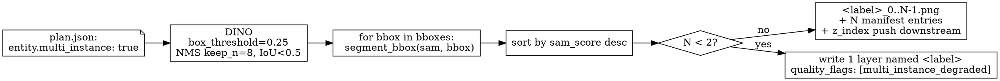
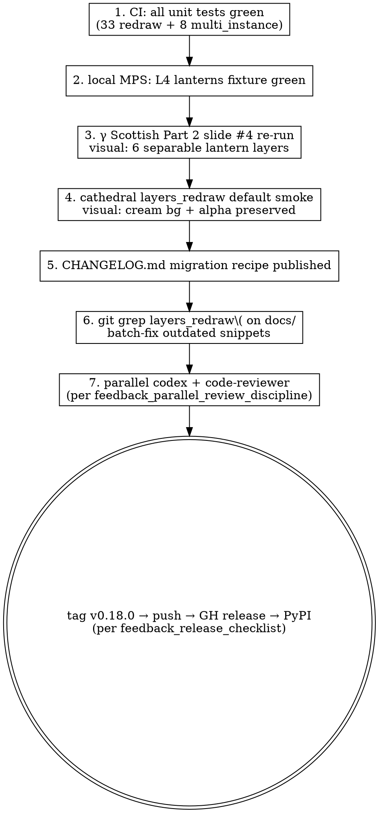

# Vulca v0.18.0 Design — `layers_redraw` Default Flip + `layers_split` Multi-Instance

**Date**: 2026-04-26
**Author**: brainstorm session, ratified by maintainer
**Target version**: 0.18.0
**Time window**: 2026-04-26 → 2026-04-29 (4 days)
**Predecessor**: v0.17.15 (ca9682c4)

## Problem statement

Two structural gaps surfaced during the γ Scottish Part 2 carousel showcase (2026-04-25), recorded as memory entries:

1. **`layers_redraw` silently destroys input** — overwrites the input layer PNG in-place with no backup or docstring warning. When fed an alpha-sparse RGBA layer, providers (gpt-image-2 / Gemini) interpret transparent pixels as "fill empty space" and hallucinate a full scene around the visible entity. v0.17.14 introduced opt-in defenses (`output_layer_name`, `background_strategy`, `preserve_alpha`) but kept legacy defaults, so the trap remains the path of least resistance.
2. **`layers_split` orchestrated mode is structurally single-instance** — `_nms_bboxes()` enforces top-1 per label, and the per-entity loop calls SAM exactly once. Multi-instance entities (a row of 6 lanterns, a crowd, a stack of plates) collapse into one union bbox + a fragmented SAM mask (sam_score frequently < 0.65). This was deferred to v0.18 in the v0.17.13 CHANGELOG.

## Decisions ratified during brainstorm

| # | Decision | Choice | Alternatives considered |
|---|---|---|---|
| Q1 | `layers_redraw` default-flip aggression | **Full flip** of all three knobs to safer defaults; legacy behavior available via explicit opt-in | half-flip / no-flip / flip-with-deprecation-warning |
| Q2 | Multi-instance API shape | **`multi_instance: true` per-entity flag** in plan JSON | new mode enum / heuristic auto-fallback / hybrid flag+quality_flag feedback |
| Q3 | Multi-instance manifest layout | **Flat siblings, index-named** (`<label>_0..N-1`); zero downstream changes | spatial naming / parent-child group nodes / single-layer multi-mask |
| Q4 | Multi-instance behavior contract | **Soft auto + hard cap 8** with `multi_instance_degraded` quality_flag on under-detection | required N kwarg / range contract / fully-hardcoded |
| Q5 | Test depth | **Unit tests + L4 real DINO/SAM fixture**; no L5 real-provider | unit-only / unit+L4+L5 / showcase-only acceptance |

Rationale for each choice is preserved in the conversation transcript and not duplicated here.

## Architecture

### Change A — `layers_redraw` default flip (no new code path)

| Parameter | v0.17.x default | v0.18.0 default | Behavior change |
|---|---|---|---|
| `output_layer_name` | `""` (in-place) | `""` (still empty, but new resolution rule below) | Output goes to `<layer>_redrawn.png` instead of overwriting input |
| `background_strategy` | `"transparent"` | `"cream"` | Alpha-sparse layers flattened onto cream RGB before provider call → no scene hallucination |
| `preserve_alpha` | `False` | `True` | Original layer's alpha re-applied to redraw output → output keeps the layer's silhouette |

**New parameter** to disambiguate the MCP-serialized "empty string vs default" case:

```python
in_place: bool = False
```

Resolution rule for output path:

```python
if in_place:
    out_path = input_layer_path                          # explicit legacy override
elif output_layer_name:
    out_path = artwork_dir / f"{output_layer_name}.png"  # explicit user-provided name
else:
    out_path = artwork_dir / f"{layer}_redrawn.png"      # new default: auto-derived
```

`in_place=True` takes precedence; `output_layer_name` is silently ignored when `in_place=True` (no error, simpler contract).

### Change B — `layers_split` orchestrated `multi_instance`

When `entity.multi_instance == true` in plan JSON, the orchestrator switches to a multi-bbox path:

1. **DINO call**: `detect_all_bboxes()` accepts a per-entity `box_threshold` override; for multi-instance entities it's lowered from the default to 0.25 for that entity only (other entities in the same plan keep the default).
2. **NMS**: `_nms_bboxes(keep_n=8)` returns up to 8 bboxes ordered by score, deduplicated at IoU ≥ 0.5. The `keep_n` kwarg defaults to `1` so single-instance callers see no change.
3. **SAM loop**: `segment_bbox(sam_pred, bbox)` runs once per surviving bbox.
4. **Layer write**: each instance becomes a flat sibling layer named `<label>_<i>`, ordered by `sam_score` descending. `<label>_0` is the most confident.
5. **z_index push**: subsequent entities in the plan have their `z_index` incremented by `(N - 1)` to make room.
6. **Quality flag**: if DINO returns < 2 bboxes despite the flag, the result is one degraded layer named `<label>` (no suffix) with `quality_flags: ["multi_instance_degraded"]`.



### Plan JSON schema (additive, backward-compatible)

```json
{
  "object_entities": [
    {
      "label": "lanterns",
      "z_index": 2,
      "multi_instance": true
    }
  ]
}
```

`multi_instance` is optional; absent or `false` preserves legacy single-instance behavior. No version bump on plan schema.

## Component-level changes

| File | Change | Approx LOC |
|---|---|---|
| `src/vulca/layers/redraw.py` | Flip 3 defaults; add `in_place` kwarg; rewrite docstring with new defaults + opt-out recipe; update output-path resolution at lines 317–363 | ~25 |
| `src/vulca/mcp_server.py` (redraw wrapper, lines 754–832) | Sync defaults; add `in_place: bool = False`; rewrite docstring | ~15 |
| `scripts/claude_orchestrated_pipeline.py` | Extend `_nms_bboxes()` with `keep_n: int = 1` kwarg (default keeps single-instance behavior); add multi-instance branch in entity loop (lines 1219–1260); add `box_threshold` per-entity override; emit quality_flags | ~60 |
| `src/vulca/pipeline/segment/orchestrator.py` | Read `multi_instance` flag from plan; pass through to claude pipeline; no signature change | ~5 |
| `tests/test_layers_redraw.py` | Update ~30 existing assertions for new defaults; add 3 new opt-out test cases | ~70 |
| `tests/test_layers_v2_split.py` | New `class TestMultiInstance` with 8 unit cases + 1 L4 fixture case | ~150 |
| `tests/fixtures/multi_instance/lanterns_6.jpg` | New binary fixture (crop from γ Scottish source) | — |
| `src/vulca/_version.py` | `0.17.15` → `0.18.0` | 1 |
| `CHANGELOG.md` | v0.18.0 section with migration recipe | ~35 |

**Total**: ~360 LOC + 1 binary fixture.

## Edge cases and error handling

### `multi_instance` edge cases

| Scenario | Behavior | Output signal |
|---|---|---|
| DINO returns 0 bbox | Write 0 layers | `quality_flags: ["multi_instance_no_detection"]` |
| DINO returns 1 bbox | Write 1 layer named `<label>` (**no `_0` suffix**) | `quality_flags: ["multi_instance_degraded"]` |
| DINO returns 2–8 bbox | Write N layers `<label>_0..N-1`, sorted by sam_score desc | (no flag) |
| DINO returns > 8 bbox | Take top-8 by score; drop the rest | (no flag — cap is by design) |
| z_index collision after expansion | N siblings occupy `z..z+N-1`; **all** subsequent entities in plan order auto-increment by `(N-1)` regardless of pre-existing gap (deterministic, no collision-detection logic) | reflected in manifest |
| `<label>_0.png` already exists | Overwrite (consistent with v0.17.x split semantics) | (no signal) |
| Single + multi entities mixed in same plan | Each handled independently; no cross-effect | (no signal) |

**Why degraded fallback uses `<label>` (no suffix)**: callers chain on the entity's canonical name (`redraw(layer="lanterns")`); when DINO under-detects, breaking that contract would cascade silently. Using the canonical name + `quality_flags` lets callers detect the degradation through the existing quality-flag mechanism (introduced v0.17.13) rather than guessing from filenames.

### `layers_redraw` default-flip edge cases

| Scenario | Behavior |
|---|---|
| Caller passes only `layer` and `instruction` | Writes `<layer>_redrawn.png`, cream bg, alpha preserved (new default) |
| Caller passes `in_place=True` | Overwrites `<layer>.png` (legacy parity) |
| Caller passes `in_place=True` and `output_layer_name="foo"` | `in_place` wins; `output_layer_name` silently ignored |
| Caller passes `background_strategy="transparent"` | Hallucination-prone path, explicit opt-in, no warning |
| Caller passes `preserve_alpha=False` | Alpha not re-applied, explicit opt-in, no warning |

## Breaking-change migration

CHANGELOG.md must publish a recipe section:

```
# v0.17.x behavior:
layers_redraw(artwork_dir, layer="lanterns", instruction="...")
# → wrote IN-PLACE to lanterns.png
# → "transparent" bg → provider hallucinated full scene
# → alpha was dropped, layer became flat RGB

# v0.18.0 default behavior:
layers_redraw(artwork_dir, layer="lanterns", instruction="...")
# → writes lanterns_redrawn.png (input untouched)
# → cream bg → no scene hallucination
# → original alpha re-applied to redraw output

# To restore v0.17.x behavior verbatim (NOT recommended):
layers_redraw(
    artwork_dir, layer="lanterns", instruction="...",
    in_place=True,
    background_strategy="transparent",
    preserve_alpha=False,
)
```

Additionally: `git grep "layers_redraw(" docs/` will be run during D3 to catch any tutorial/showcase code snippets relying on the old defaults; those get updated in the same release.

No `DeprecationWarning` is emitted. The decision (Q1=A) is to absorb the breaking change into the SemVer minor bump (still <1.0) rather than maintain a deprecation tail. Historical context: `feedback_release_checklist.md` and `user_collaboration_style.md` together establish that this project ships fast and prefers clean breaks over warning noise.

## YAGNI — explicitly out of scope for v0.18

| Idea | Reason for exclusion |
|---|---|
| `DeprecationWarning` on legacy `layers_redraw` kwargs | Q1 chose A; <1.0 doesn't warrant a deprecation tail |
| Group/parent manifest nodes for multi-instance | Q3 chose A (flat); group nodes would require updating all 6 downstream tools |
| Spatial naming (`lanterns_left/center/right`) | Degrades past 4 instances; index naming is universally extensible |
| Auto-trigger of `multi_instance` from quality_flags | Q4 chose A (explicit only); two competing truth sources would clash with v0.17.13 quality_flags |
| L5 real-provider integration tests | Q5 chose B; `layers_redraw` on a multi-instance child layer is functionally identical to existing v0.17.14 single-layer redraw, already covered |
| Whole-group redraw (`redraw(layer="lanterns")` redrawing 6 children atomically) | Requires Q3=C (group nodes); v0.19+ |
| Per-instance custom prompts in plan | Schema-breaking; v0.19+ |
| Heuristic auto-cropping of source image to per-instance bbox before SAM | Out of scope; SAM already handles tight bboxes |

## Risk register

| Risk | Likelihood | Mitigation |
|---|---|---|
| Old showcase scripts / dev.to article snippets break under flipped defaults | Medium | CHANGELOG migration recipe + `git grep "layers_redraw("` over `docs/` and `assets/demo/` during D3, batch-fix |
| L4 fixture test bloats CI runtime | Low | Marked `@pytest.mark.l4_local`; default-skipped in CI, runs only locally before tagging |
| DINO weight changes invalidate exact instance counts | Low | Assertions use `N >= 3` and `sam_score > 0.5` (loose lower bounds), not exact counts |
| z_index push has off-by-one for edge cases (e.g., entity with 0 detections in middle of plan) | Medium | Unit test #3 explicitly covers z_index push; mixed-entity test #8 covers interleaving |
| Default-flip causes pixel-hash mismatch in any existing real-provider test | High (expected) | L4 redraw tests assert structural properties (size, alpha presence) instead of pixel hashes |
| Multi-instance test imports torch-heavy `scripts/claude_orchestrated_pipeline.py` and reddens CI | Medium | Per `feedback_test_imports_torch_heavy_scripts.md`: tests import from `src/vulca/pipeline/segment/orchestrator.py` (pure functions) and mock the DINO/SAM seam |

## Testing strategy

### Unit tests (CI, fast, no GPU)

**`tests/test_layers_redraw.py`** — update existing ~30 cases:

- Replace `assert out_path == input_path` with `assert out_path.endswith("_redrawn.png")`
- Replace "hallucinated full-scene output" assertions with "cream bg + alpha preserved"

Plus 3 new cases:

| Test name | Assertion |
|---|---|
| `test_redraw_default_writes_to_redrawn_suffix` | `out_path == artwork_dir / "lanterns_redrawn.png"` |
| `test_redraw_in_place_true_overwrites_input` | `out_path == artwork_dir / "lanterns.png"` (legacy parity) |
| `test_redraw_in_place_overrides_output_layer_name` | `in_place=True` + `output_layer_name="foo"` → out_path is input path, not foo.png |

**`tests/test_layers_v2_split.py`** — new `class TestMultiInstance` (8 unit cases):

| # | Test name | Mock DINO returns | Key assertion |
|---|---|---|---|
| 1 | `test_flag_off_legacy_behavior` | top-1 | 1 layer named `lanterns`, no quality_flag (regression guard) |
| 2 | `test_flag_on_returns_n_layers` | 6 bboxes | manifest has 6 entries `lanterns_0..5` |
| 3 | `test_z_index_pushes_subsequent_entities` | lanterns→6, then person z=3 | post-expansion `person.z_index == 8` |
| 4 | `test_degraded_when_dino_returns_one` | 1 bbox | 1 layer named `lanterns` (no suffix) + `multi_instance_degraded` flag |
| 5 | `test_no_detection` | 0 bbox | 0 layers + `multi_instance_no_detection` flag |
| 6 | `test_caps_at_8` | 12 bboxes | exactly 8 layers, top-by-score retained |
| 7 | `test_naming_sorted_by_sam_score_desc` | 3 bboxes with distinct scores | `lanterns_0.sam_score > lanterns_1 > lanterns_2` |
| 8 | `test_mixed_single_and_multi_in_same_plan` | lanterns multi + cathedral single | cathedral path unaffected by lanterns expansion |

### L4 real fixture test (`@pytest.mark.l4_local`, CI skipped)

**Fixture**: `tests/fixtures/multi_instance/lanterns_6.jpg` — crop from `docs/visual-specs/2026-04-23-scottish-chinese-fusion/decompose/lanterns_source_crop.png`.

```python
@pytest.mark.l4_local
def test_l4_real_dino_sam_on_lanterns_fixture():
    plan = {"object_entities": [{"label": "lanterns", "z_index": 1, "multi_instance": True}]}
    result = layers_split(
        image_path="tests/fixtures/multi_instance/lanterns_6.jpg",
        plan=plan,
    )
    layers = [l for l in result["layers"] if l["name"].startswith("lanterns")]
    assert len(layers) >= 3, "DINO should detect at least 3 lanterns on this fixture"
    for l in layers:
        assert l["sam_score"] > 0.5, f"sam_score too low for {l['name']}"
    bboxes = [l["bbox"] for l in layers]
    for i, b1 in enumerate(bboxes):
        for b2 in bboxes[i + 1:]:
            assert iou(b1, b2) < 0.5, "instances should not overlap heavily"
    assert "multi_instance_degraded" not in result.get("quality_flags", [])
```

Loose bounds (`>= 3` instead of `== 6`) keep the test stable across DINO weight updates.

## Acceptance gate before tagging v0.18.0



## Timeline

| Day | Date | Tasks | Deliverable |
|---|---|---|---|
| **D1** | 2026-04-26 | (a) `superpowers:writing-plans` produces implementation plan; (b) `_version.py` 0.17.15 → 0.18.0; (c) `layers_redraw` default flip + `in_place` kwarg + docstring | redraw signature stable, defaults flipped |
| **D2** | 2026-04-27 | (a) `_nms_bboxes(keep_n=N)`; (b) entity loop multi_instance branch; (c) plan flag passthrough; (d) 8 unit tests written incrementally | multi_instance unit tests green |
| **D3** | 2026-04-28 | (a) `tests/test_layers_redraw.py` 30 assertions batch-update + 3 new cases; (b) lanterns fixture prepared; (c) L4 test landed; (d) `git grep` over docs/, fix outdated snippets | all tests + docs clean |
| **D4** | 2026-04-29 | (a) γ Scottish Part 2 slide #4 acceptance re-run; (b) cathedral redraw smoke; (c) CHANGELOG.md; (d) parallel double-review (codex + code-reviewer); (e) commit + tag + push + GH release + PyPI | v0.18.0 shipped |

**Buffer**: 0 days. If D2 or D3 surfaces unexpected issues (e.g., DINO multi-bbox API doesn't behave as expected), fallback plan is to ship v0.18.0 with **only** the `layers_redraw` default flip (Change A) + documented `multi_instance` backlog deferred to v0.18.1, rather than push quality.

## Memory-triggered compliance gates

| Memory entry | Gate it triggers |
|---|---|
| `feedback_parallel_review_discipline.md` | D4 must dispatch codex + code-reviewer in parallel |
| `feedback_release_checklist.md` | After tagging: must push + GH release + PyPI three-step |
| `feedback_git_add_all_caution.md` | Commits stage explicit file lists, never `git add -A/.` |
| `feedback_test_imports_torch_heavy_scripts.md` | Multi_instance unit tests import from `src/vulca/pipeline/segment/orchestrator.py` (pure) + mock DINO/SAM seam; never import `scripts/claude_orchestrated_pipeline.py` directly |
| `feedback_brainstorm_before_feature_plans.md` | Satisfied by this brainstorm session |
| `feedback_dogfood_showcase_through_triad.md` | γ Scottish acceptance re-run goes through `/visual-plan`, not a one-off Python script |
| `feedback_layers_redraw_inplace_overwrite.md` | Closed by Change A |
| `feedback_decompose_multi_instance_gap.md` | Closed by Change B |
| `feedback_cream_flat_reference_limit.md` | Closed by Change A (cream becomes default) |

## References

- v0.17.13 CHANGELOG (forward reference to v0.18 multi-instance)
- v0.17.14 release (introduced opt-in defenses being defaulted here)
- γ Scottish Part 2 showcase (2026-04-25): `docs/visual-specs/2026-04-23-scottish-chinese-fusion/decompose/`
- Memory entries linked above
- Conversation transcript (this brainstorm)
